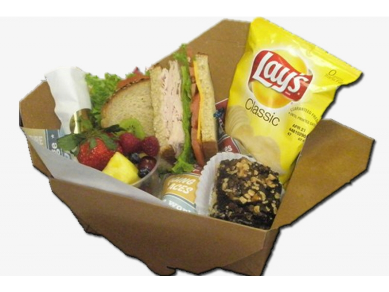
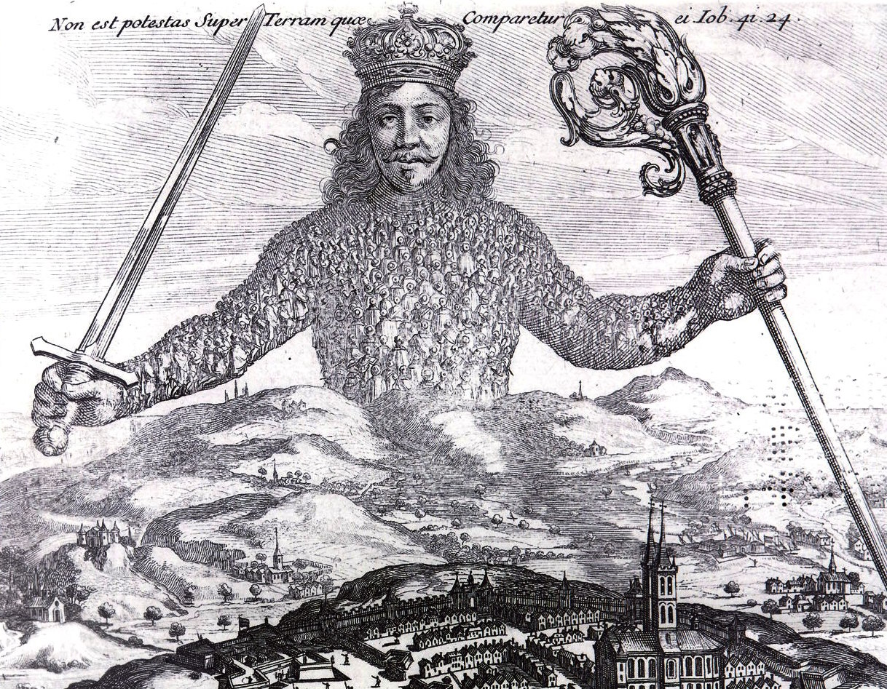
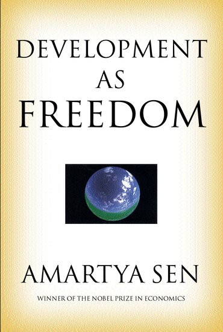
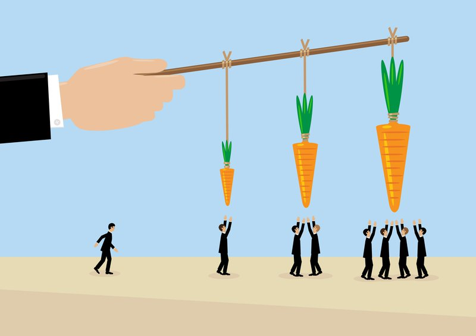
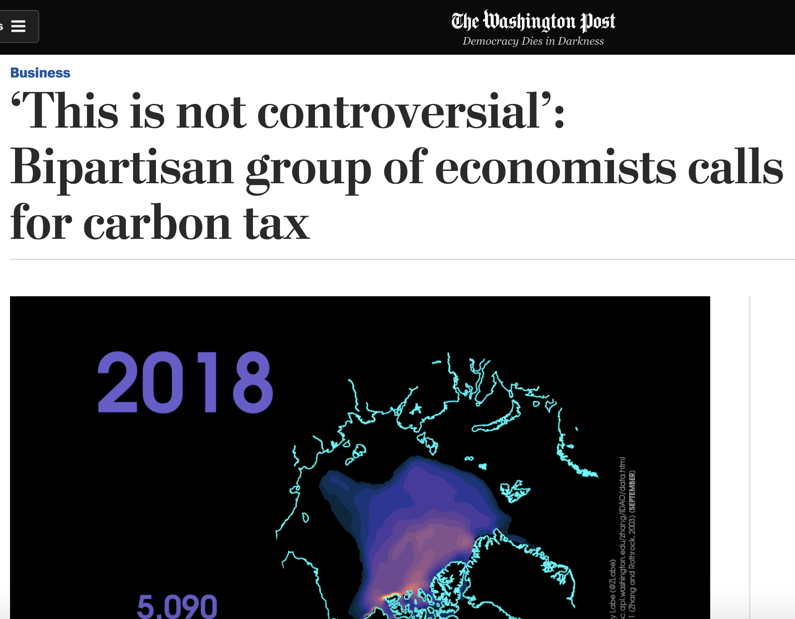
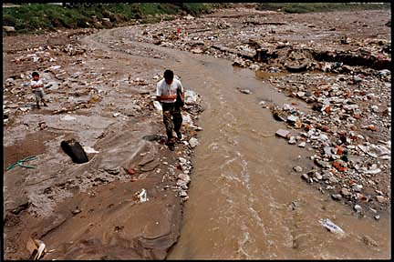
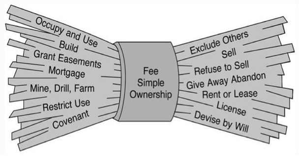
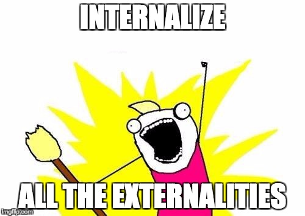
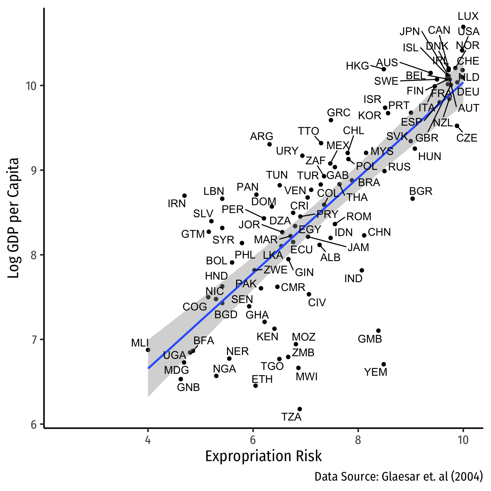

```{r setup, include=FALSE}
options(htmltools.dir.version = FALSE)
knitr::opts_chunk$set(echo=F,
                      message=F,
                      warning=F,
                      fig.retina = 3,
                      fig.align = "center")
library("tidyverse")
library("mosaic")
library("ggrepel")
library("fontawesome")
xaringanExtra::use_tile_view()
xaringanExtra::use_tachyons()
xaringanExtra::use_freezeframe()
xaringanExtra::use_progress_bar()

update_geom_defaults("label", list(family = "Fira Sans Condensed"))
update_geom_defaults("text", list(family = "Fira Sans Condensed"))

set.seed(256)
```

class: inverse

# Outline

### [When and Why Markets are Great](#4)
### [Market Efficiency and Welfare](#14)
### [Collective Action Problems](#28)
### [Public Goods](#35)
### [Externalities: When the Price Isn't Right](#44)

---

# A Reminder (and a Reprieve for a Week or Two)

```{r, fig.width=12}
red_pink <- "#e64173"
blue <- "#2b59c3"

venn_colors <- c(red_pink, blue)
venn_lines <- rep("solid", 10)
# Locations of circles
venn_df <- tibble(
  x  = c( 0.0,   2.0),
  y  = c( 0.0,   0.0),
  r  = c( 2.0,   2.0),
  l  = c( "Math \n Modeling", "Thinking Like \n an Economist"),
  xl = c( -1.0,    3.0),
  yl = c( 0.0,   0.0))
# Venn
ggplot(data = venn_df, aes(x0 = x, y0 = y, r = r, fill = l, color = l)) +
ggforce::geom_circle(aes(linetype = l), alpha = 0.3, size = 0.75) +
theme_void() +
theme(legend.position = "none") +
scale_fill_manual(values = venn_colors) +
scale_color_manual(values = venn_colors) +
scale_linetype_manual(values = venn_lines) +
  geom_text(aes(x = xl, y = yl, label = l), size = 8, family = "Fira Sans Condensed") +
coord_equal()
```


---

class: inverse, center, middle
# When and Why Markets are Great

---

# The Origins of Exchange I

.pull-left[
- Why do we trade?

- .hi-purple[Resources are in the wrong place!]

- People have *better* uses of resources than they are currently being used! 

]

.pull-right[
.center[

]
]

---

# The Origins of Exchange II

.pull-left[
- *Why* are resources in the wrong place?

- .hi-purple[We have the *same* stuff but different preferences]


]

.pull-right[
.center[



]
]

---

# The Origins of Exchange III

.pull-left[
- *Why* are resources in the wrong place?

- .hi-purple[We have *different* stuff and different preferences]

]

.pull-right[
.center[


]
]

---

# Transaction Costs and Exchange I

.pull-left[
- But .hi[Transaction costs]!
  - .hi-purple[Search costs]: cost of finding trading partners
  - .hi-purple[Bargaining costs]: cost of reaching an agreement
  - .hi-purple[Enforcement costs]: **trust** between parties, cost of upholding agreement, dealing with unforeseen contingencies, punishing defection, using police and courts 
]

.pull-right[
.center[

]
]

---

# Transaction Costs and Exchange II

.pull-left[
- With high transaction costs, resources *cannot* be traded

- Resources *cannot* be switched to higher-valued uses

- If others value goods higher than their current owners, resources are *inefficiently* allocated!
]

.pull-right[
.center[

]
]

---

# Transaction Costs and Exchange III

.pull-left[
.center[

]
]

.pull-right[
- .hi[Markets] are institutions that facilitate voluntary *impersonal* exchange and reduce transaction costs

- There's a lot of institutions in the "bundle" we call "markets": 
  - Prices, profits and losses, property rights, rule of law, contract enforcement, dispute resolution, protection, trust

]

---

# Transaction Costs and Exchange III

.pull-left[
.center[

]
]

.pull-right[
- All of those things are *assumed* when we draw nice supply & demand graphs on the blackboard

- Other PSCI/ECON courses: how do various *political & social institutions* enable markets to flourish? (some of my courses):
  - [ECON 315: Economics of the Law](https://laws21.classes.ryansafner.com)
  - [ECON 317: Economics of Development](https://devf21.classes.ryansafner.com)
  - [ECON 324: Industrial Organization](https://ios20.classes.ryansafner.com)
  - [ECON 470: Public Economics](https://publics20.classes.ryansafner.com)
]

---

# What Does "Efficiency" Mean?

.pull-left[

- Regular sense of the word:

- Achieving a .hi-purple[specified goal] with as .hi-purple[few resources as possible]

- .hi-green[Examples]:
  - driving
  - carrying groceries
  - producing pencils
]

.pull-right[
.center[

]
]

---

# Problem: What Goal for Society?

.pull-left[

- We will ruminate more on this next class

- .hi-purple[Society, government, law, etc. has no single, universally agreed-upon goal]

- “Society” is not a choosing agent
]

.pull-right[
.center[

]
]

---

# Social Problems that Markets Solve Well 

.pull-left[
.center[

]
]

.pull-right[
- .hi[Problem 1]: Resources have multiple uses and are rivalrous

- .hi[Problem 2]: Different people have different subjective valuations for uses of resources

- .hi-purple[It is inefficient (immoral?) to use a resource in a way that prevents someone else who values it more from using it!]
]


---

# Social Problems that Markets Solve Well 

.pull-left[
.center[

]
]

.pull-right[

- **Solution**: Prices in a functioning market accurately measure .hi[opportunity cost] of using resources in a particular way

- .hi-purple[The price of a resource is the amount someone else is willing to pay to acquire it from its current use/owner]
]


---

class: inverse, center, middle

# Markets & Efficiency

---

# Economic Efficiency: First Pass

.pull-left[

.hi[Economic efficiency]: degree to which as many people as possible get as much as possible of what they want
  - degree of .hi-purple[preference satisfaction]

- How do we measure this?
  - Expanding budget set $\implies$ satisfying more goals
  - Income is a main constraint $\implies$ maximize incomes
  - GDP per capita: market value of what is produced $\iff$ incomes
]

.pull-right[

```{r, fig.retina=3}
points<-tribble(
  ~letter, ~x, ~y,
  "A", 10, 5,
  "B", 12, 6,
)

IC_1=function(x){50/x}
IC_2=function(x){72/x}
BC=function(x){10-0.5*x}
BC2=function(x){12-0.5*x}

ggplot(data.frame(x=c(0,10)), aes(x=x))+
  stat_function(fun=IC_1, geom="line", size=2, color = "blue")+
    geom_label(aes(x=4,y=IC_1(4)), color = "blue", label=expression(u[1]), size = 4)+
    stat_function(fun=IC_2, geom="line", size=2, color = "#3CBB75FF")+
    geom_label(aes(x=4,y=IC_2(4)), color = "#3CBB75FF", label=expression(u[2]), size = 4)+
  stat_function(fun=BC, geom="line", size=2, color = "red")+
    geom_label(aes(x=2,y=BC(2)), color = "red", label="BC", size = 6)+
    stat_function(fun=BC2, geom="line", size=2, linetype="dashed", color = "darkred")+
    geom_label(aes(x=2,y=BC2(2)), color = "darkred", label="BC 2", size = 6)+
  geom_point(data = points,
             mapping=aes(x=x, y=y),
             size = 3)+
  geom_segment(aes(x = 0, xend = 10, y = 5, yend=5), linetype="dotted", size=1)+
  geom_segment(aes(x = 10, xend = 10, y = 5, yend=0), linetype="dotted", size=1)+
  geom_segment(aes(x = 0, xend = 12, y = 6, yend=6), linetype="dotted", size=1)+
  geom_segment(aes(x = 12, xend = 12, y = 6, yend=0), linetype="dotted", size=1)+
  annotate("segment", x = 10.5, xend = 11.5, y = 5, yend = 6, colour = "black", size=2, alpha=1, arrow=arrow(length=unit(0.5,"cm"), ends="last", type="closed"))+
    scale_x_continuous(breaks=c(10,12),
                       labels=c(expression(x[1]),expression(x[2])),
                     limits=c(0,20),
                     expand=expand_scale(mult=c(0,0.1)))+
  scale_y_continuous(breaks=c(5,6),
                       labels=c(expression(y[1]),expression(y[2])),
                     limits=c(0,20),
                     expand=expand_scale(mult=c(0,0.1)))+
  #scale_colour_manual("Curves", values = line_colors, guide=F)+
  labs(x = "x",
       y = "y")+
  theme_classic(base_family = "Fira Sans Condensed", base_size=20)
```
]

---

# The Economic Point of View

.pull-left[

- Preferences are .hi-purple[subjective]
  - .hi-purple[Egalitarianism]: Nobody's preferences are dismissed

- .hi-turquoise[Higher incomes + freedom of choice = greater preference satisfaction]

- Harder to directly evaluate outcomes, better to look at basic processes/mechanisms (especially exchange)
]

.pull-right[
.center[

]
]

---

# Perfectly Competitive Market

.pull-left[
```{r, fig.retina=3, fig.height=4.5}
demand<-function(x){10-x}
supply<-function(x){x}
demand_firm<-function(x){10}
mc_cc<-function(x){3*x^2-8*x+9}
ac_cc<-function(x){x^2-4*x+10+10/x}

pc<-ggplot(data.frame(x=c(0,10)), aes(x=x))+
  stat_function(fun=demand_firm, geom="line", size=2, color = "blue")+
  geom_label(aes(x=4.5,y=demand_firm(4.5)), color = "blue", label="Demand", size = 5)+
    stat_function(fun=mc_cc, geom="line", size=2, color = "red")+
  geom_label(aes(x=3.5,y=mc_cc(3.5)), color = "red", label="MC(q)", size = 5)+
    stat_function(fun=ac_cc, geom="line", size=2, color = "orange")+
  geom_label(aes(x=4.5,y=ac_cc(4.5)), color = "orange", label = "AC(q)", size = 5)+
  geom_segment(x=2.8, xend=2.8, y=0, yend=10, size=1, linetype="dotted")+
    scale_x_continuous(breaks=NULL,
                     limits=c(0,5),
                     expand=expand_scale(mult=c(0,0.1)))+
  scale_y_continuous(breaks=NULL,
                     limits=c(0,20),
                     expand=expand_scale(mult=c(0,0.1)))+
  guides(fill=F)+
  labs(title = "Representative Firm",
       x = "Quantity",
       y = "Price")+
  theme_classic(base_family = "Fira Sans Condensed", base_size=20)
pc
```
]

.pull-right[
```{r, fig.retina=3, fig.height=4.5}
cs_1<-tribble(
  ~x, ~y,
  0, 10,
  0, 5,
  5, 5
)
ps_1<-tribble(
  ~x, ~y,
  0, 0,
  0, 5,
  5, 5
)

ggplot(data.frame(x=c(0,10)), aes(x=x))+
  geom_polygon(data=cs_1, aes(x=x,y=y), fill="blue", alpha=0.5)+
  geom_polygon(data=ps_1, aes(x=x,y=y), fill="red", alpha=0.5)+
  stat_function(fun=demand, geom="line", size=2, color = "blue")+
    geom_label(aes(x=9,y=demand(9)), color = "blue", label="Demand", size = 5)+
  stat_function(fun=supply, geom="line", size=2, color = "red")+
    geom_label(aes(x=9,y=supply(9)), color = "red", label="Supply", size = 5)+
  geom_segment(x=5, xend=5, y=0, yend=5, size=1, linetype="dotted")+
  geom_segment(x=0, xend=5, y=5, yend=5, size=1, linetype="dotted")+
  
  # point A
  geom_point(x = 5, y = 5, size=3)+
  geom_text(x = 5, y = 5.5, label = "A", size=5)+
  
    scale_x_continuous(breaks=NULL,
                     limits=c(0,10),
                     expand=expand_scale(mult=c(0,0.1)))+
  scale_y_continuous(breaks=NULL,
                     limits=c(0,10),
                     expand=expand_scale(mult=c(0,0.1)))+
  guides(fill=F)+
  labs(title = "Industry",
       x = "Quantity",
       y = "Price")+
  theme_classic(base_family = "Fira Sans Condensed", base_size=20)
```
]

.smallest[
- In a .hi[competitive market] in .hi[long run equilibrium]:
  - .hi-purple[Economic profit] is driven to $0; resources (factors of production) optimally allocated
  - .hi-purple[Allocatively efficient]: $p=MC(q)$, maximized .blue[CS] $+$ .red[PS]
  - .hi-purple[Productively efficient]: $p=AC(q)_{min}$ (otherwise firms would enter/exit)
]

---

# Allocative Efficiency in Competitive Equilibrium I

.pull-left[

```{r, fig.retina=3}
Demand=function(x){10-x}
Supply=function(x){x}
eq<-tribble(
  ~letter, ~x, ~y,
  "A", 5, 5
)

CS<-tibble(x=c(0,0,5),
           y=c(5,10,5))

PS<-tibble(x=c(0,0,5),
           y=c(0,5,5))

p<-ggplot(data.frame(x=c(0,10)), aes(x=x))+
  stat_function(fun=Demand, geom="line", size=2, color = "blue")+
  stat_function(fun=Supply, geom="line", size=2, color = "red")+
  geom_label(aes(x=9,y=Demand(9)), color = "blue", label="Demand = MB", size = 6)+
  geom_label(aes(x=9,y=Supply(9)), color = "red", label="Supply = MC", size = 6)+
  geom_segment(aes(x=0, xend=5, y=5, yend=5),size=1, linetype="dotted")+
  geom_segment(aes(x=5, xend=5, y=5, yend=0),size=1, linetype="dotted")+
  geom_polygon(data=CS, aes(x=x,y=y), fill="blue", alpha=0.5)+ #CS
  geom_polygon(data=PS, aes(x=x,y=y), fill="red", alpha=0.5)+ #PS
  geom_label(aes(x=1.5, y= 3), label="PS", color="red", size =6)+
  geom_label(aes(x=1.5, y= 7), label="CS", color="blue", size =6)+
  geom_point(data = eq,
             mapping=aes(x=x, y=y),
             size = 4)+
  geom_text_repel(data = eq,
             mapping=aes(x=x, y=y,
             label = letter),
             size = 6)+
    scale_x_continuous(breaks=seq(0,10,1),
                     limits=c(0,10),
                     expand=expand_scale(mult=c(0,0.1)))+
  scale_y_continuous(breaks=seq(0,10,1),
                     limits=c(0,10),
                     expand=expand_scale(mult=c(0,0.1)))+
  guides(fill=F)+
  labs(x = "Quantity",
       y = "Price")+
  theme_classic(base_family = "Fira Sans Condensed", base_size=20)
p
```

]

.pull-right[

- .hi[Allocative efficiency]: resources are allocated to highest-valued uses
  - Goods are produced up to the point where .blue[marginal benefit] $=$ .red[marginal costs]
]

---

# Allocative Efficiency in Competitive Equilibrium II

.pull-left[

```{r, fig.retina=3}
p
```

]

.pull-right[

- **Economic surplus** = .blue[Consumer surplus] + .red[Producer surplus]

- Maximized in competitive equilibrium

- Resources flow away from those who value them the lowest (min WTA) to those that value them the highest (max WTP)
  - creating .red[PS] and .blue[CS]

- .hi-purple[The social value of resources is **maximized** by allocating them to their highest valued uses!]

]

---

# Markets and Pareto Efficiency

.pull-left[
.smallest[
- Suppose we start from some initial allocation (.blue[A])

]
]

.pull-right[
```{r}
pareto_points<-tribble(
  ~x, ~y, ~letter, ~fill,
  4, 5, "A", "Endowment",
  2, 5, "B", "No",
  2, 7, "C", "No",
  4, 9, "D", "Yes",
  6, 8, "E", "Yes",
  8, 7, "F", "Yes",
  9, 5, "G", "Yes",
  7, 3, "H", "No",
  4, 3, "I", "No"
)

ggplot(data = tibble(x=1:10),aes(x=x))+
  geom_label(data = subset(pareto_points, letter=="A"), aes(x=x, y=y, label = letter, fill = fill), color = "white")+
  labs(x = "Person 1’s Goods",
       y = "Person 2’s Goods")+
  scale_fill_manual("Improvement?",
                    values = c("Endowment" = "blue", "Yes" = "green", "No" = "red"))+
  scale_x_continuous(breaks=seq(0,10,1),
                     limits = c(0,10),
                     expand=c(0,0))+
  scale_y_continuous(breaks=seq(0,10,1),
                     limits = c(0,10),
                     expand=c(0,0))+
  ggthemes::theme_pander(base_family = "Fira Sans Condensed", base_size = 16)

```

]

---

# Markets and Pareto Efficiency

.pull-left[
.smallest[
- Suppose we start from some initial allocation (.blue[A])

- .hi[Pareto Improvement]: at least one party is better off, and no party is worse off
  - .green[D, E, F, G] are improvements
  - .red[B, C, H, I] are not

]
]

.pull-right[
```{r}
pareto<-ggplot(data = tibble(x=1:10),aes(x=x))+
  geom_label(data = pareto_points, aes(x=x, y=y, label = letter, fill = fill), color = "white")+
  labs(x = "Person 1’s Goods",
       y = "Person 2’s Goods")+
  scale_fill_manual("Improvement?",
                    values = c("Endowment" = "blue", "Yes" = "green", "No" = "red"))+
  scale_x_continuous(breaks=seq(0,10,1),
                     limits = c(0,10),
                     expand=c(0,0))+
  scale_y_continuous(breaks=seq(0,10,1),
                     limits = c(0,10),
                     expand=c(0,0))+
  ggthemes::theme_pander(base_family = "Fira Sans Condensed", base_size = 16)
pareto
```
]

---

# Markets and Pareto Efficiency

.pull-left[
.smallest[
- Suppose we start from some initial allocation (.blue[A])

- .hi[Pareto Improvement]: at least one party is better off, and no party is worse off
  - .green[D, E, F, G] are improvements
  - .red[B, C, H, I] are not

- .hi[Pareto optimal/efficient]: no possible Pareto improvements
  - Set of Pareto efficient points often called the .hi-green[Pareto frontier]<sup>.magenta[†]</sup>
  - Many possible efficient points!

]

.tiny[<sup>.magenta[†]</sup>I’m simplifying...for full details, see [class 1.8 appendix](https://microf20.classes.ryansafner.com/files/CT_Application_2_Exchange.pdf) about applying consumer theory!]

]

.pull-right[
```{r}
pareto+annotate("segment", x = 4, xend = 4, y = 5, yend = 10, color = "purple", size=2, alpha=1, arrow=arrow(length=unit(0.5,"cm"), ends="last", type="closed"))+
  annotate("segment", x = 4, xend = 10, y = 5, yend = 5, color = "purple", size=2, alpha=1, arrow=arrow(length=unit(0.5,"cm"), ends="last", type="closed"))+
  geom_rect(xmin=4,xmax=10,ymin=5,ymax=10,fill="green",alpha=0.025)+
  geom_segment(x = 4, y = 9, xend=6, yend=8, color = "green", size = 2)+
  geom_segment(x = 6, y = 8, xend=8, yend=7, color = "green", size = 2)+
  geom_segment(x = 8, y = 7, xend=9, yend=5, color = "green", size = 2)
```
]


---

# Markets and Pareto Efficiency

.pull-left[
.smallest[
- Voluntary exchange in markets is a .hi[Pareto improvement]

- *In equilibrium*, markets are .hi[Pareto efficient]: there are no more possible Pareto improvements
  - all gains from trade exhausted, $q_S=q_D$, no pressure for change

- Note Pareto efficiency contains a normative claim about .hi-purple[equity]
  - It might be possible to improve the *total* welfare of *society*
  - But if this comes *at the expense of even 1 individual*, it’s not a Pareto improvement!
]
]
.pull-right[

.center[

]
]

---

# Markets and Pareto Efficiency

.pull-left[

- Pareto efficiency is conceptual gold standard: allow all welfare-improving exchanges so long as nobody gets harmed

- In practice: Pareto efficiency is a *first best* solution
  - only takes one holdout to disapprove to violate Pareto efficiency

]

.pull-right[

.center[

]
]

---

# Markets and Kaldor-Hicks Efficiency

.pull-left[
.quitesmall[
- .hi[Kaldor-Hicks Improvement]: an action improves efficiency its generates more social gains than losses
    - those made better off could **in principle** compensate those made worse off

- .hi[Kaldor-Hicks efficiency]: no potential Kaldor-Hicks improvements exist

- Keeps intuitive appeal of Pareto but more practical
    - Every Pareto improvement is a KH-improvement (but not the other way around!)
    
- Consider policies where winners' maximum WTP $>$ losers' minimum WTA

- Policies should **maximize social value of resources**
]
]

.pull-right[

.center[


]
]

---

# Pareto vs. Kaldor-Hicks Efficiency

.pull-left[
.smallest[
- .hi-green[Example]: .hi-purple[“eminent domain”]

- The “takings clause” of the 5<sup>th</sup> Amendment to the U.S. Constitution:

> “No person shall...be deprived of life, liberty, or property, without due process of law; nor shall private property be taken for public use, without just compensation.”

- What is a “public use”? What is “just compensation”?

- [*Kelo v. City of New London*](https://en.wikipedia.org/wiki/Kelo_v._City_of_New_London), 545 U.S. 469 (2005
]
]
.pull-right[

.center[


]
]

---

# Welfare Economics
.pull-left[
.smallest[
- .hi[1st Fundamental Welfare Theorem]: markets in competitive equilibrium maximize (allocative, Pareto, KH, productive) efficiency
  - initial endowments does not affect efficiency but does affect final distribution

- .hi[2nd Fundamental Welfare Theorem]: any desired Pareto efficient distribution can be achieved with a *one-time* redistribution, and *then* let markets operate freely
  - allows a desired distribution to be achieved without sacrificing efficiency

]
]

.pull-right[
.center[

]
]

---

# Welfare Economics

.smallest[
- **Markets are great when:**
  1. They are .hi-purple[Competitive]: many buyers and many sellers
  2. They each .hi-purple[equilibrium] (.hi-purple[prices are free to adjust]): absence of transactions costs or policies *preventing prices from adjusting* to meet supply and demand
  3. .hi-purple[There are no externalities]<sup>.magenta[†]</sup> are present: costs and benefits are fully internalized by the parties to transactions 
]

--

.smallest[
- If any of these conditions are not met, we have .hi[market failure]
  - May be a role for governments, other institutions, or entrepreneurs to fix
]

.footnote[<sup>.magenta[†]</sup> Or public goods, or asymmetric information. But in essence, I am treating these as special cases of more common externalities.]

---

class: inverse, center, middle

# Collective Action Problems

---

# Generalizing: Collective Action Problems

.pull-left[

- .hi[Collective action problem]: situation where an individual's interest and a group's interest may conflict

- Benefits (or costs) of outcome are **nonrival** and flow to *all members* of the group

- Decisions & costs need to be incurred by individuals

- **Individual preferences** need to aggregate into a **single decision/outcome**
]

.pull-right[
.center[

]
]

---

# Collective Action Problem: Examples I

.center[

]

---

# Collective Action Problem: Examples II

.center[

]

---

# Collective Action Costs I

.pull-left[

- Groups may share a **common interest**

- But **composed of individuals with their own preferences**
  - Individuals bear the personal cost of contributing
  - Individuals gain a small share of the benefits of group action

- Additionally, **transaction costs/ bargaining** to get a group to agree on decision
]

.pull-right[
.center[

]

]

---

class: inverse, center, middle

# Public Goods

---

# A Classic Economic Problem

.pull-left[
.center[

]
]

.pull-right[

- .hi[Public Good]: a good that is .hi-purple[non-rival] and .hi-purple[non-excludable]

- .hi-purple[Rivalry]: one use of a resource removes it from other uses

- .hi-purple[Excludability]: ability or right to prevent others from using it (ownership)

]

---

# The Free Rider Problem

.pull-left[
- Individual bears a **private cost to contribute**, but only gets a **small fraction of the (dispersed) benefit** of a good

- If individuals can gain **access** to the good (nonexcludable) **without paying**, may lead to...

- .hi[Free riding]: individuals consume the good without paying for it
]

.pull-right[
.center[

]
]

---

# Examples?

.pull-left[
.center[

]
]

.pull-right[
.center[

]
]

---

# Market Failure from Public Goods

.pull-left[

- No incentive for people to contribute and pay for the good

- If enough people obtain the benefits without incurring the costs...

- **Not profitable** for private market actors to supply it

]

.pull-right[
.center[

]
]

---

# Adam Smith on Public Goods

.left-column[
.center[


.smallest[
Adam Smith

1723-1790
]
]
]
.right-column[

"The third and last duty of the sovereign or commonwealth is that of .hi[erecting and maintaining those public institutions and those public works], which, though they may be in the highest degree advantageous to a great society, are, however, .hi[of such a nature that the profit could never repay the expence to any individual or small number of individuals], and which it therefore .hi[cannot be expected that any individual or small number of individuals should erect or maintain]. The performance of this duty requires, too, very different degrees of expence in the different periods of society," (Book VI, Ch. 9).

.source[Smith, Adam, 1776, *An Enquiry into the Nature and Causes of the Wealth of Nations*]

]

---

# Public Goods $\neq$ "Good for the Public"

```{r, fig.width=12}
red_pink <- "#e64173"
blue <- "#2b59c3"

venn_colors <- c(red_pink, blue)
venn_lines <- rep("solid", 10)
# Locations of circles
venn_df <- tibble(
  x  = c( 0.0,   2.0),
  y  = c( 0.0,   0.0),
  r  = c( 2.0,   2.0),
  l  = c( "Things Governments \n Provide", "Public Goods"),
  xl = c( -1.0,    3.0),
  yl = c( 0.0,   0.0))
# Venn
ggplot(data = venn_df, aes(x0 = x, y0 = y, r = r, fill = l, color = l)) +
ggforce::geom_circle(aes(linetype = l), alpha = 0.3, size = 0.75) +
theme_void() +
theme(legend.position = "none") +
scale_fill_manual(values = venn_colors) +
scale_color_manual(values = venn_colors) +
scale_linetype_manual(values = venn_lines) +
  geom_text(aes(x = xl, y = yl, label = l), size = 8, family = "Fira Sans Condensed") +
coord_equal()
```

---

# Implications: Selective Incentives

.pull-left[

- Groups often need .hi["selective incentives"] to **reward contribution** and to **punish free riding** in groups

- Positive and negative incentives
]

.pull-right[
.center[

]

]

---

# Religions, Clubs, Cults, and Social Groups

.pull-left[
.quitesmall[
- Groups provide immaterial, “social/spiritual goods”, to individuals
  - e.g. comfort, community, friendship, support system, therapy, good vibes
  - Ex: religions, clubs, cults, fraternities/sororities, social groups, etc.

- To be a good member, you must .hi[contribute] to the group and not just be a drain on its resources

- Groups often do some combination of the following to overcome the free rider problem:<sup>.magenta[†]</sup>
  - .hi[Sacrifice]: members invest in costly & observable behavior: wear particular outfits, attend meetings, learn rituals, pay dues, eat particular diet, etc.
  - .hi[Stigma]: members who don’t contribute or make the sacrifice are shamed & ostracized (or kicked out)

]

]

.pull-right[
.center[

]

.tiny[<sup>.magenta[†]</sup> See [today’s readings page](/content/3.4-content) for great podcast and paper on the economics of religion using these tools.]

]

---

class: inverse, center, middle

# Externalities: When the Price Isn’t Right

---

```{r}
library("mosaic")
demand_1=function(x){10-x}
supply_1=function(x){x}

changes<-ggplot(data.frame(x=c(0,10)), aes(x=x))+
  stat_function(fun=demand_1, geom="line", size=2, color = "blue")+
    geom_label(aes(x=9,y=demand_1(9)), color = "blue", label="MSB", size = 8)+
  stat_function(fun=supply_1, geom="line", size=2, color = "#e64173")+
    geom_label(aes(x=9,y=supply_1(9)), color = "#e64173", label="MSC", size = 8)+
  geom_segment(x=0, xend=5, y=5, yend=5, size=1, linetype="dotted")+
  geom_segment(x=5, xend=5, y=0, yend=5, size=1, linetype="dotted")+
    scale_x_continuous(breaks=seq(0,10,1),
                     limits=c(0,10),
                     expand=expand_scale(mult=c(0,0.1)))+
  scale_y_continuous(breaks=seq(0,10,1),
                     limits=c(0,10),
                     expand=expand_scale(mult=c(0,0.1)),
                     labels = function(x){paste("$", x, sep="")})+
  labs(x = "Quantity (q)",
       y = "Price (p)")+
  theme_classic(base_family = "Fira Sans Condensed", base_size=20)
```

# Supply and Demand: Social Costs & Benefits

.pull-left[

```{r, fig.retina=3}

changes
```

]

.pull-right[

- .hi-blue[Demand: marginal social benefit (MSB)]
  - value to consumers of consuming output

- .hi-pink[Supply: marginal social cost (MSC)]
  - opportunity cost of pulling resources out of other uses

- **Equilibrium**: $MSB=MSC$
  - using resources efficiently, no *better* alternative uses
]

---

# Supply and Demand: Social Costs & Benefits

.pull-left[

```{r, fig.retina=3}

changes
```

]

.pull-right[

- **Price system** mitigates costs and benefits of people's actions

- People using scarce resources must **account for consequences**:
  - Pay to pull scarce resources out of other uses in society
  - Compensated for producing something valuable for others

]

---

# Externality 

.pull-left[

- .hi[Externality]: an action that incurs a cost or a benefit not compensated via prices

- Often interpretted as an action that affects (benefits or harms) a third party not privy to the action

]

.pull-right[

.center[

]
]

---

# Externality 

.pull-left[
- The real problem is that it is .hi-purple[external] to the price system!
  - A missing market!

- People base decisions off of their preferences and opportunity costs of resources for society (captured in prices)

- Prices properly negotiate the opportunity costs and provide information to people 

- But without price, decisions do not .hi-purple[internalize] those effects! 
]

.pull-right[

.center[

]
]

---

# Negative Externality

.pull-left[

```{r, fig.retina=3}
supply_up=function(x){x-2}

changes+
  stat_function(fun=supply_up, geom="line", size=2, color = "#fb6107")+
    geom_label(aes(x=9,y=supply_up(9)), color = "#fb6107", label="MPC", size = 8)+
  geom_segment(x=0, xend=6, y=4, yend=4, size=1, linetype="dotted")+
  geom_segment(x=6, xend=6, y=0, yend=4, size=1, linetype="dotted")+
  geom_point(aes(x = c(5,6),
                 y = c(5,4)),
             size = 4)+
  geom_text(x=5,y=5.5, label="A", size=8)+
  geom_text(x=6,y=4.5, label="B", size=8)
```

]

.pull-right[

.hi-pink[Marginal _Private_ Cost] to producer
is less than
.hi-red[Marginal _Social_ Cost] to society

**Market Equilibrium (B)** too much $q$ at too low $p$ compared to **Social Optimum (A)**
]

---

# Negative Externality

.pull-left[

```{r, fig.retina=3}
changes+
  stat_function(fun=supply_up, geom="line", size=2, color = "#fb6107")+
    geom_label(aes(x=9,y=supply_up(9)), color = "#fb6107", label="MPC", size = 8)+
  geom_segment(x=0, xend=6, y=4, yend=4, size=1, linetype="dotted")+
  geom_segment(x=6, xend=6, y=0, yend=4, size=1, linetype="dotted")+
  geom_point(aes(x = c(5,6),
                 y = c(5,4)),
             size = 4)+
  geom_text(x=5,y=5.5, label="A", size=8)+
  geom_text(x=6,y=4.5, label="B", size=8)+
  
  annotate("segment", x = 6, xend = 6, y = 4, yend = 6, colour = "purple", size=2, alpha=1, arrow=arrow(length=unit(0.5,"cm"), ends="both", type="closed"))+
  geom_label(x=8, y=5, label="External Cost", color = "purple", size =8)+
    geom_segment(x=0, xend=6, y=6, yend=6, size=1, linetype="dotted")


```

]

.pull-right[

.hi-pink[Marginal _Private_ Cost] to producer
is less than
.hi-red[Marginal _Social_ Cost] to society

**Market Equilibrium (B)** too much $q$ at too low $p$ compared to **Social Optimum (A)**

- Overproduction due to external cost

]

---

# Negative Externality

.pull-left[

```{r, fig.retina=3}
dwl_neg<-tribble(
  ~x, ~y,
  5, 5,
  6, 6,
  6, 4
)

changes+
  geom_polygon(data = dwl_neg,
               aes(x = x,
                   y = y),
               fill = "black",
               alpha = 0.7)+
  stat_function(fun=supply_up, geom="line", size=2, color = "#fb6107")+
    geom_label(aes(x=9,y=supply_up(9)), color = "#fb6107", label="MPC", size = 8)+
  geom_segment(x=0, xend=6, y=4, yend=4, size=1, linetype="dotted")+
  geom_segment(x=6, xend=6, y=0, yend=4, size=1, linetype="dotted")+
  geom_point(aes(x = c(5,6),
                 y = c(5,4)),
             size = 4)+
  geom_text(x=5,y=5.5, label="A", size=8)+
  geom_text(x=6,y=4.5, label="B", size=8)+
  
  annotate("segment", x = 6, xend = 6, y = 4, yend = 6, colour = "purple", size=2, alpha=1, arrow=arrow(length=unit(0.5,"cm"), ends="both", type="closed"))+
  geom_label(x=8, y=5, label="External Cost", color = "purple", size =8)+
    geom_segment(x=0, xend=6, y=6, yend=6, size=1, linetype="dotted")
```

]

.pull-right[

.hi-pink[Marginal _Private_ Cost] to producer
is less than
.hi-red[Marginal _Social_ Cost] to society

**Market Equilibrium (B)** too much $q$ at too low $p$ compared to **Social Optimum (A)**

- Overproduction due to external cost

- A **deadweight loss** from overproduction
]

---

# Negative Externality: Pigouvian Solution

.left-column[
.center[


A.C. Pigou

1877-1959
]
]

.right-column[

- Policy solutions to externalities should .hi-purple[focus on the missing price]
  - Narrowly tailor policy to create or modify price

- “Pigouvian” tax or subsidy
]

---

# Negative Externality: Pigouvian Solution

.pull-left[

```{r, fig.retina=3}
ggplot(data.frame(x=c(0,10)), aes(x=x))+
  stat_function(fun=demand_1, geom="line", size=2, color = "blue")+
    geom_label(aes(x=9,y=demand_1(9)), color = "blue", label="MSB", size = 8)+
  stat_function(fun=supply_1, geom="line", size=2, color = "red")+
    geom_label(aes(x=9,y=supply_1(9)), color = "red", label="MSC=MPC+t", size = 8)+
  geom_segment(x=0, xend=5, y=5, yend=5, size=1, linetype="dotted")+
  geom_segment(x=5, xend=5, y=0, yend=5, size=1, linetype="dotted")+
    scale_x_continuous(breaks=seq(0,10,1),
                     limits=c(0,10),
                     expand=expand_scale(mult=c(0,0.1)))+
  scale_y_continuous(breaks=seq(0,10,1),
                     limits=c(0,10),
                     expand=expand_scale(mult=c(0,0.1)),
                     labels = function(x){paste("$", x, sep="")})+
  labs(x = "Quantity (q)",
       y = "Price (p)")+
  theme_classic(base_family = "Fira Sans Condensed", base_size=20)
```

]

.pull-right[

- Set a specific tax 
$$t = MSC-MPC$$

- Eliminates the DWL

- .hi-purple[Internalizes the externality] into the price system

- Producers (and consumers) now consider the true cost to society
  - $MPC$ (with tax) $=MSC$
]

---

# Pigouvian Taxes

.pull-left[
.center[

]
]

.pull-right[
"Sitting is banned in the following places: "in St. Mark’s Square and in Piazzetta dei Leoncini, beneath the arcades and on the steps of the Procuratie Nuove, the Napoleonic Wing, the Sansovino Library, beneath the arcades of the Ducal Palace, in the impressive entranceway to St. Mark’s Square otherwise known as Piazzetta San Marco and its jetty." ($200)
]

---

# Pigouvian Taxes

.pull-left[
.center[

]
]

.pull-right[
.smallest[
> "I. A carbon tax offers the most cost-effective lever to reduce carbon emissions at the scale and speed that is necessary. By correcting a well-known market failure, a carbon tax will send a powerful price signal that harnesses the invisible hand of the marketplace to steer economic actors towards a low-carbon future."

Signed by 27 Economics Nobel Laureates, 4 former Federal Reserve chairs, among many other famous economists
]
]

---

# Pigouvian Taxes

.pull-left[
.center[

]
]

.pull-right[
.smallest[

> "II. A carbon tax should increase every year until emissions reductions goals are met and be revenue neutral to avoid debates over the size of government. A consistently rising carbon price will encourage technological innovation and large-scale infrastructure development. It will also accelerate the diffusion of carbon-efficient goods and services."


Signed by 27 Economics Nobel Laureates, 4 former Federal Reserve chairs, among many other famous economists
]
]

---

# Pigouvian Taxes

.pull-left[
.center[

]
]

.pull-right[
.smallest[

> "III. A sufficiently robust and gradually rising carbon tax will replace the need for various carbon regulations that are less efficient. Substituting a price signal for cumbersome regulations will promote economic growth and provide the regulatory certainty companies need for long-term investment in clean-energy alternatives."

Signed by 27 Economics Nobel Laureates, 4 former Federal Reserve chairs, among many other famous economists
]
]

---

# But It’s Not That Simple

.left-column[
.center[

]
]

.right-column[

- How do we know what the right tax is? Will it be borne by the right parties?

- Will it be administered correctly?

- Are there opportunities for corruption?
]

---

# Externalities Adjudicated at Law

.pull-left[
.smallest[
- Most externalities in U.S. mediated through common law legal system

- Courts assess how much harm was caused

- Individuals causing harm to others must pay:
  - **compensatory damages** (to redress harms)
  - **punitive damages** (to deter future externalities)
    
- Externalities persist if property rights are *not* clear or are *not* enforced

]
]

.pull-right[
.center[

]
]

---

# Externalities as a Property Rights Problem

.left-column[
.center[


.smaller[
Ronald H. Coase

(1910-2013)

Economics Nobel 1991]

]
]

.right-column[
.smallest[
- .hi[Externalities] outside the market system of prices are a problem

- Externalities can be framed as a problem of .hi-purple[property rights]

- Exchange is really about property rights over goods and services, (not just the goods themselves)

- Origin of the problem is: .hi-purple[property rights are not clear (undefined or unenforced)]!
  - Who has right/responsibility over activity creating the external harm?

- .hi[Coase Theorem]: if transactions costs are low, clearly defined property rights allow parties to bargain to the efficient social outcome *regardless* of who has the property right
]
]

---

# Another Classic Economic Problem

.pull-left[
.center[

]
]

.pull-right[

- .hi[Tragedy of the commons]: multiple people have unrestricted access to the same .hi-purple[rivalrous] resource

- .hi-purple[Rivalry]: one use of a resource removes it from other uses


.source[Hardin, Garett, 1968, "The Tragedy of the Commons," *Science* 162(3859):1243-1248]

]

---

# Another Classic Economic Problem

.pull-left[
.center[

]
]

.pull-right[

- Cannot exclude others

- No responsibility over outcome

- Incentive to **overexploit** and **deplete** resource (before others do)

- A negative externality on others
]

---

# Classic Solution: Property Rights

.pull-left[
.center[

]
]

.pull-right[
.smaller[
- .hi[Property rights]: socially agreed upon rules that determine how resources are used

- Often thought of as a .hi[bundle of rights] that can be separated and given to different people

- Primary right is the .hi-purple[right to exclude others] from using a rivalrous resource

.center[

]

]
]
---

# Property Rights Internalize Externalities

.pull-left[

- Links ownership and responsibility

- Causing arm to others' property $\implies$ liability for damages

- Externalities as (unenforced) property rights
]

.pull-right[
.center[
*"Good fences make good neighbors"*

]
]

---

# Goal

.center[

]

---

# Economic Analysis of Law

.pull-left[
.center[

]
]

.pull-right[

- An entire field of economics dedicated to this: Law & Economics
  - My specialty

- See my [ECON 315 — Economics of the Law](https://laws21.classes.ryansafner.com) course
]
---

# In Aggregate: Property Rights Matter

.pull-left[
.center[

]

]

.pull-right[
.smallest[
**Expropriation Risk**: Risk of "outright confiscation and forced nationalization" of property. This variable **ranges from zero to ten where higher values are equals a lower probability of expropriation.** This variable is **calculated as the average from 1982 through 1997**, or for specific years as needed in the tables. Source: International Country Risk Guide at http://www.countrydata.com/datasets/.

]

.source[Glaesar, Edward L, Rafael La Porta, Florencio Lopez-de-Silanes, and Andrei Shleifer, 2004, "Do Institutions Cause Growth?" *Journal of Economic Growth* 9: 271-303]

]

---

# Summarizing Types of Goods

.pull-left[
.smallest[
- Can classify into 4 types of goods based on .hi-purple[rivalry] & .hi-purple[excludability]
]
]

.pull-right[

]

---

# Summarizing Types of Goods

.pull-left[
.smallest[
- Can classify into 4 types of goods based on .hi-purple[rivalry] & .hi-purple[excludability]

- Economics mostly focuses on .hi[“private goods”]
]
]

.pull-right[

]

---

# Summarizing Types of Goods

.pull-left[
.smallest[
- Can classify into 4 types of goods based on .hi-purple[rivalry] & .hi-purple[excludability]

- Economics mostly focuses on .hi[“private goods”]

- Largest issues with .hi[“public goods”]
]
]

.pull-right[

]

---

# Summarizing Types of Goods

.pull-left[
.smallest[
- Can classify into 4 types of goods based on .hi-purple[rivalry] & .hi-purple[excludability]

- Economics mostly focuses on .hi[“private goods”]

- Largest issues with .hi[“public goods”]

- Can transform public goods into .hi[“club goods”] by making them *excludable*
  - Managed by an organization, transformed by technology
  - Think about selective incentives

]
]
.pull-right[

]

---

# Club Goods

.center[

]

---

# Summarizing Types of Goods

.pull-left[
.smallest[
- Can classify into 4 types of goods based on .hi-purple[rivalry] & .hi-purple[excludability]

- Economics mostly focuses on .hi[“private goods”]

- Largest issues with .hi[“public goods”]

- Can transform public goods into .hi[“club goods”] by making them *excludable*
  - Managed by an organization, transformed by technology
  - Think about selective incentives

- .hi[“Common resources”] can be managed with the right set of rules or property rights (otherwise the .b[tragedy of the commons] results)
]
]
.pull-right[

]

---

# Common Resources

.left-column[
.center[


.smallest[
Elinor Ostrom

1933—2012

Economics Nobel 2009
]
]
]

.right-column[

.smallest[
- A wide variety of solutions are possible for managing common resources efficiently
  - Government management
  - Purely private property
  - Civil society organizations

- So long as they set up **good rules** that solve the free rider problem, remove the incentive to overuse resource, negative externality on others
]

.center[

]
]

---

# An Example, Using Social Norms

.center[
<iframe width="980" height="550" src="https://www.youtube.com/embed/wugiZzoREPU" title="YouTube video player" frameborder="0" allow="accelerometer; autoplay; clipboard-write; encrypted-media; gyroscope; picture-in-picture" allowfullscreen></iframe>
]

---

# An Example: Wikipedia

.pull-left[
.center[

]
]

.pull-right[
.center[

]
]

.source[Safner, Ryan, 2016, [“Institutional Entrepreneurship, Wikipedia, and the Opportunity of the Commons,”](https://ryansafner.com/publication/institutional-entrepreneurship-wikipedia-and-the-opportunity-of-the-commons/) *Journal of Institutional Economics* 12(4): 743-771]