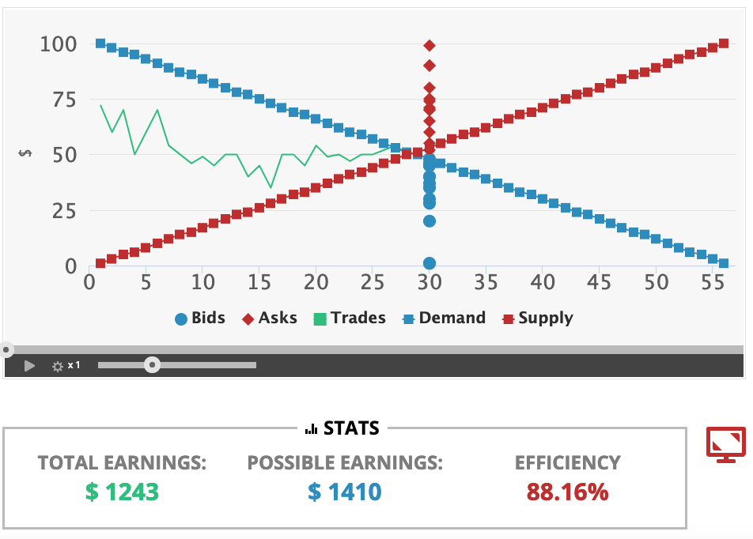
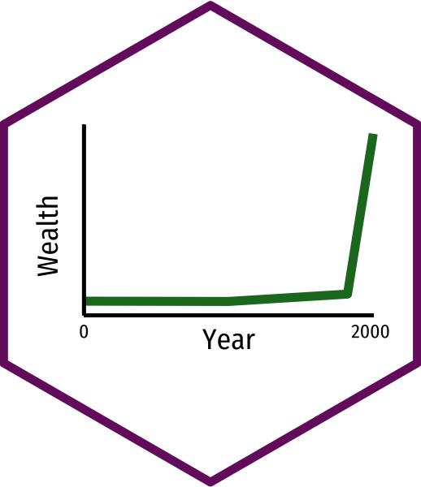

```{r setup, include=FALSE}
options(htmltools.dir.version = FALSE)
knitr::opts_chunk$set(echo=F,
                      message=F,
                      warning=F,
                      fig.retina = 3,
                      fig.align = "center")
library("tidyverse")
library("mosaic")
library("ggrepel")
library("fontawesome")
xaringanExtra::use_tile_view()
xaringanExtra::use_tachyons()
xaringanExtra::use_freezeframe()

update_geom_defaults("label", list(family = "Fira Sans Condensed"))
update_geom_defaults("text", list(family = "Fira Sans Condensed"))

set.seed(256)
```

class: inverse

# Outline

### [Why Markets Tend to Equilibrate, Redux](#7)
### [The Social Functions of Market Prices](#23)
### [Uncertainty and Profits](#37)

---

# The Model is Not the Reality I

.pull-left[
.center[

]
]

.pull-right[
.smallest[
- This course is about economic modeling and formal theory

- Applications in ECON electives

- Models help us *understand* reality, but they *are not* reality!
  - Don't mistake the map for the territory itself

> *"All models are wrong. Some are useful"* - George Box

]
]

---

# The Model is Not the Reality II

.pull-left[
.center[

]
]

.pull-right[
.smallest[
- Our models so far have given us interesting results: 
  - Markets reach equilibrium
  - Economic profits are zero in the long run in competitive markets

- Both are **fictional**

- But the models **still** show us useful insights about how a market economy works

- Some readings in today's readings page to help you understand

]
]

---

# The Model is Not the Reality III

.center[


Source: [SMBC](https://www.smbc-comics.com/comic/2013-09-19)

“Shame on the three of you who enjoyed this joke”
]

---

# The Model is Not the Reality III

.center[

]

---

class: inverse, center, middle

# Why Markets Tend to Equilibrate, Redux

---

# The Law of One Price I


.pull-left[
- .hi[Law of One Price]: *all* units of the *same* good exchanged on the market will tend to have the same market price (the market-clearing price, $p^*)$
]

.pull-right[

```{r, fig.retina=3}
library("mosaic")
library("ggrepel")
update_geom_defaults("label", list(family = "Fira Sans Condensed"))

Demand=function(x){10-x}
Supply=function(x){x}

eq<-tribble(
  ~letter, ~x, ~y,
  "A", 5, 5
)

ggplot(data.frame(x=c(0,10)), aes(x=x))+
  stat_function(fun=Demand, geom="line", size=2, color = "blue")+
  stat_function(fun=Supply, geom="line", size=2, color = "red")+
  geom_label(aes(x=9,y=Demand(9)), color = "blue", label="Demand", size = 6)+
  geom_label(aes(x=9,y=Supply(9)), color = "red", label="Supply", size = 6)+
  geom_segment(aes(x=0, xend=5, y=5, yend=5),size=1, linetype="dotted")+
  geom_segment(aes(x=5, xend=5, y=5, yend=0),size=1, linetype="dotted")+
  geom_point(data = eq,
             mapping=aes(x=x, y=y),
             size = 4)+
  geom_text_repel(data = eq,
             mapping=aes(x=x, y=y,
             label = letter),
             size = 6)+
    scale_x_continuous(breaks=seq(0,10,1),
                     limits=c(0,10),
                     expand=expand_scale(mult=c(0,0.1)))+
  scale_y_continuous(breaks=seq(0,10,1),
                     limits=c(0,10),
                     expand=expand_scale(mult=c(0,0.1)))+
  coord_cartesian(clip="off")+
  labs(x = "Quantity",
       y = "Price")+
  theme_classic(base_family = "Fira Sans Condensed", base_size=20)

```

]

---

# The Law of One Price II

.pull-left[
.center[

]
]

.pull-right[
.smaller[
- Consider if there are *multiple* different prices for *same* good:

- .hi-purple[Arbitrage] opportunities: optimizing individuals recognize **profit opportunity**:
    - Buy at low price, resell at high price!
    - There are possible gains from trade or gains from innovation to be had
    
- .hi-purple[Entrepreneurship]: recognizing profit opportunities and entering a market as a seller to try to capture gains from trade/innovation
]
]


---

# Arbitrage and Entrepreneurship I

.center[

]

---

# Arbitrage and Entrepreneurship II

.center[
<iframe width="980" height="550" src="https://www.youtube.com/embed/HiB9L3dG-Aw" frameborder="0" allow="accelerometer; autoplay; encrypted-media; gyroscope; picture-in-picture" allowfullscreen></iframe>
]

---

# Arbitrage and Entrepreneurship III

.center[
<iframe width="980" height="550" src="https://www.youtube.com/embed/yGf6LNWY9AI" frameborder="0" allow="accelerometer; autoplay; encrypted-media; gyroscope; picture-in-picture" allowfullscreen></iframe>
]

---

# Uncertainty vs. Risk

.center[

<iframe width="980" height="550" src="https://www.youtube.com/embed/GiPe1OiKQuk" frameborder="0" allow="accelerometer; autoplay; encrypted-media; gyroscope; picture-in-picture" allowfullscreen></iframe>

]

---

# Uncertainty vs. Risk

.left-column[
.center[

]
]

.right-column[

- **“Known knowns”**: .hi-purple[perfect information]

- **“Known unknowns”**: .hi-purple[risk]
  - We know the probability distribution of states that *could* happen
  - We just don't know *which* state will be realized
  - We can estimate probabilities, maximize expected value, minimize variance, etc.

]

---

# Uncertainty vs. Risk

.left-column[
.center[

]
]

.right-column[

- **“Unknown unknowns”**: .hi[uncertainty]
  - We don’t even know the probability distribution of states that *could* happen
  - *No model to optimize* in a world of uncertainty!
]

---

# The Role of Entrepreneurial Judgment

.left-column[
.center[


]
]

.right-column[

- Under true .hi[uncertainty], it’s not that we can’t assign probabilities to each outcome; we do not even have the knowledge necessary to list all possible outcomes!

- Requires .hi-purple[entrepreneurial judgment] to *both*:
  1. estimate possible actions *and*
  2. estimate the likelihood of their success

- .hi[Entrepreneur] is central player, earns pure profits (a residual) for *bearing uncertainty*
]

---

# Entrepreneurial Judgment

.left-column[
.center[

.smallest[
Henry Ford

1863-1947
]
]

]

.right-column[

> “If I had asked people what they wanted, they would have said **faster horses**.” - Henry Ford

]

---

# Entrepreneurial Judgment

.pull-left[
.center[

]
]

.pull-right[

> “It's really hard to design products by focus groups. A lot of times, **people don't know what they want until you show it to them**.” - Steve Jobs
]

---

# Uncertainty and Entrepreneurship

.left-column[
.center[


Mark Zuckerberg

1984-
]
]

.right-column[

> "Why were we the ones to build [Facebook]? We were just students. We had way fewer resources than big companies. If they had focused on this problem, they could have done it. 
The only answer I can think of is: **we just cared more**. 
**While some doubted** that connecting the world was actually important, **we were building**. While others doubted that this would be sustainable, **we were forming lasting connections**."
]


---

# How Markets Get to Equilibrium I

.pull-left[
.center[

]
]

.pull-right[
.smaller[
- .hi-turquoise[Nobody knows “the right price” for things]

- Each buyer and seller only know **their own** reservation prices

- Buyers and sellers adjust their bids/asks 

- Markets do not *start* competitive, but *become* competitive!

- New entrepreneurs enter to try to capture gains from trade/innovation

- As these gains are exhausted, prices converge to equilibrium 
]
]


---

# How Markets Get to Equilibrium II

.pull-left[
.center[

]
]

.pull-right[
.smaller[
- Errors and imperfect information $\implies$ multiple prices 
    - $\implies$ arbitrage opportunities $\implies$ entrepreneurship
    - $\implies$ correcting mistakes $\implies$ people update their behavior & expectations  

- Markets are .hi-purple[discovery processes] that *discover* the right prices, the optimal uses of resources, and cheapest production methods, none of which can be known in advance!
]

]

---

# How Markets Get to Equilibrium III

.pull-left[
.center[

]
]


.pull-right[
.smallest[
- Economy as a cat-and-mouse game between:
  - **Mouse**: preferences, technologies, alternative uses of resources
  - **Cat**: market prices, least-cost technologies

- Cat always chasing mouse
  - Mouse *always* moving
  - Any time cat hasn’t caught mouse: profit opportunities

- **IF** mouse *froze*, market would rest at equilibrium 
]

]

---

class: inverse, center, middle

# The Social Functions of Market Prices

---

# Prices are Signals I

.center[

]

---

# Prices are Signals II

.pull-left[
.center[

]
]

.pull-right[
.smallest[
- .hi-purple[Markets are social *processes* that generate information via prices]

- .hi-purple[Prices are never "given"], prices .hi-purple[emerge] dynamically from negotiation and market decisions of entrepreneurs and consumers

- **Competition**: is a .hi-purple[discovery process] which *discovers* what consumer preferences are and what technologies are lowest cost, and how to allocate resources accordingly

]
]

---

# The Social Functions of Prices I

.pull-left[

.center[

]
]

.pull-right[
.smaller[
A relatively high price:

- .hi-purple[Conveys information]: good is relatively scarce

- .hi-purple[Creates incentives for]:
  - **Buyers**: conserve use of this good, seek substitutes
  - **Sellers**: produce more of this good
  - **Entrepreneurs**: find substitutes and innovations to satisfy this unmet need
]
]

---

# The Social Functions of Prices II

.pull-left[

]

.pull-right[

.smaller[
A relatively low price

- .hi-purple[Conveys information]: good is relatively abundant

- .hi-purple[Creates incentives for]:
  - **Buyers**: substitute away from expensive goods towards this good
  - **Sellers**: Produce less of this good, talents better served elsewhere
  - **Entrepreneurs**: talents better served elsewhere: find more severe unmet needs

]
]

---

# The Social Functions of Prices III

.pull-left[
.center[

]
]

.pull-right[

.smaller[
- .hi-purple[Prices tell us how to allocate scarce resources among competing uses]

- Think of diminishing marginal utility:
  - allocate scarce good to highest-valued use first
  - as supply becomes more plentiful (price falls), can allocate more units of the good to lower-valued uses (higher-valued uses already satisfied)
]
]

---

# Knowledge, “Speculation,” and Prices

.pull-left[

.smallest[
- Suppose (oil) producers believe there is going to be a shortage (of oil) in a year
]
]
.pull-right[
```{r, fig.height=4}
now<-ggplot(data = tibble(x=1:10),aes(x=x))+
  stat_function(fun=Demand, geom="line", size=2, color = "blue")+
  geom_vline(xintercept=5, geom="line", size=2, color = "red")+
  geom_label(aes(x=9,y=Demand(9)), color = "blue", label="Demand", size = 2)+
  geom_label(aes(x=5,y=9), color = "red", label="Supply", size = 2)+
  geom_segment(aes(x=0, xend=5, y=5, yend=5),size=1, linetype="dotted")+
    scale_x_continuous(breaks=NULL,
                     limits=c(0,10),
                     expand=expand_scale(mult=c(0,0.1)))+
  scale_y_continuous(breaks=NULL,
                     limits=c(0,10),
                     expand=expand_scale(mult=c(0,0.1)))+
  coord_cartesian(clip="off")+
  labs(x = "Quantity",
       y = "Price",
       title = "Market Today")+
  theme_classic(base_family = "Fira Sans Condensed", base_size=14)


future<-ggplot(data = tibble(x=1:10),aes(x=x))+
  stat_function(fun=Demand, geom="line", size=2, color = "blue")+
  geom_vline(xintercept=5, geom="line", size=2, color = "red")+
  geom_vline(xintercept=2, geom="line", size=2, color = "darkred")+
  geom_label(aes(x=9,y=Demand(9)), color = "blue", label="Demand", size = 2)+
  geom_label(aes(x=5,y=9), color = "red", label="Supply", size = 2)+
  geom_label(aes(x=2,y=9), color = "darkred", label="Future Production", size = 2)+
  geom_segment(aes(x=0, xend=5, y=5, yend=5),size=1, linetype="dotted")+

  geom_segment(aes(x=0, xend=2, y=8, yend=8),size=1, linetype="dotted")+
    scale_x_continuous(breaks=NULL,
                     expand=expand_scale(mult=c(0,0.1)))+
  scale_y_continuous(breaks=NULL,
                     limits=c(0,10),
                     expand=expand_scale(mult=c(0,0.1)))+
  coord_cartesian(clip="off")+
  labs(x = "Quantity",
       y = "Price",
       title = "Market Next Year")+
  theme_classic(base_family = "Fira Sans Condensed", base_size=14)

library(patchwork)
now+future
```
]

---

# Knowledge, “Speculation,” and Prices

.pull-left[
.smallest[
- Suppose (oil) producers believe there is going to be a shortage (of oil) in a year

- Suppose they do nothing

- In the future, a sudden spike in price
  - Demand is inelastic to sudden changes, consumers can’t adjust on the fly
  - A lot of lost economic surplus (shaded)
]
]
.pull-right[
```{r}
pricechange<-ggplot(data = tibble(x=1:10),aes(x=x))+
  geom_segment(x=0, y = 2, xend = 2, yend= 2, size=2, color = "green")+
  geom_segment(x=2, y = 2, xend = 2, yend= 6, size=2, color = "green")+
  geom_segment(x=2, y = 6, xend = 2.5, yend= 6, size=2, color = "green")+
    scale_x_continuous(breaks=c(1,2),
                       labels=c("Now", "Next Year"),
                     limits=c(0,2.5),
                     expand=expand_scale(mult=c(0,0.1)))+
  scale_y_continuous(breaks=NULL,
                     limits=c(0,8),
                     expand=expand_scale(mult=c(0,0.1)))+
  coord_cartesian(clip="off")+
  labs(x = "Time",
       y = "Price",
       title = "Price Over Time")+
  theme_classic(base_family = "Fira Sans Condensed", base_size=14)

cs<-tribble(
  ~x, ~y,
  2, 0,
  2, 8,
  5, 5,
  5, 0
)
future2<-future+
  geom_polygon(data = cs, aes(x = x, y = y), fill = "black", alpha = 0.75)

(now+future2)/pricechange
```
]

---

# Knowledge, “Speculation,” and Prices

.pull-left[

.smallest[
- Suppose (oil) producers believe there is going to be a shortage (of oil) in a year

- Suppose instead they .hi-purple[speculate], and try to profit from the future price change
  - TODAY: put some inventory .hi-purple[into storage] (take off market)
  - FUTURE: when price is higher, sell more .hi-purple[from inventories]
]
]
.pull-right[
```{r}
now2<-now+
  geom_vline(xintercept=3.5, size =2, color = "darkred")+
  geom_label(aes(x=5,y=9), color = "red", label="Supply", size = 2)+
  geom_label(aes(x=3.5,y=9), color = "darkred", label="Supply 2", size = 2)+
  geom_label(aes(x=9,y=Demand(9)), color = "blue", label="Demand", size = 2)+
  annotate("segment", x = 5, xend = 3.5, y = 3, yend = 3, colour = "purple", size=2, alpha=1, arrow=arrow(length=unit(0.25,"cm"), ends="last", type="closed"))+
  #geom_label(x=4.5,y=7, label = "Storage", color = "purple", size = 2)+
  geom_segment(x=0, y = 6.5, xend = 3.5, yend= 6.5, size=1, linetype="dotted")


future3<-ggplot(data = tibble(x=1:10),aes(x=x))+
  stat_function(fun=Demand, geom="line", size=2, color = "blue")+
  geom_label(aes(x=9,y=Demand(9)), color = "blue", label="Demand", size = 2)+
  geom_vline(xintercept=2, size =2, color = "red")+
  geom_label(aes(x=2,y=10), color = "red", label="Production", size = 2)+
  geom_vline(xintercept=3.5, size =2, color = "darkred")+
  geom_label(aes(x=3.5,y=9), color = "darkred", label="Supply 2", size = 2)+
  geom_segment(aes(x=0, xend=2, y=8, yend=8),size=1, linetype="dotted")+
  geom_segment(aes(x=0, xend=3.5, y=6.5, yend=6.5),size=1, linetype="dotted")+
  #geom_label(x=1,y=7, label = "Out of Storage", color = "purple", size = 2)+
  annotate("segment", x = 2, xend = 3.5, y = 3, yend = 3, colour = "purple", size=2, alpha=1, arrow=arrow(length=unit(0.25,"cm"), ends="last", type="closed"))+
    scale_x_continuous(breaks=NULL,
                     expand=expand_scale(mult=c(0,0.1)))+
  scale_y_continuous(breaks=NULL,
                     limits=c(0,10),
                     expand=expand_scale(mult=c(0,0.1)))+
  coord_cartesian(clip="off")+
  labs(x = "Quantity",
       y = "Price",
       title = "Market Next Year")+
  theme_classic(base_family = "Fira Sans Condensed", base_size=14)

pricechange2<-ggplot(data = tibble(x=1:10),aes(x=x))+
  geom_segment(x=0, y = 2, xend = 2, yend= 2, size=2, color = "gray", alpha =0.15)+
  geom_segment(x=2, y = 2, xend = 2, yend= 6, size=2, color = "gray", alpha =0.15)+
  geom_segment(x=2, y = 6, xend = 2.5, yend= 6, size=2, color = "gray", alpha =0.15)+
  geom_segment(x=0, y = 2, xend = 1, yend= 2, size=2, color = "green")+
  geom_segment(x=1, y = 2, xend = 1.25, yend=4, size=2, color = "green")+
  geom_segment(x=1.25, y = 4, xend = 2.5, yend= 4, size=2, color = "green")+
    scale_x_continuous(breaks=c(1,2),
                       labels=c("Now", "Next Year"),
                     limits=c(0,2.5),
                     expand=expand_scale(mult=c(0,0.1)))+
  scale_y_continuous(breaks=NULL,
                     limits=c(0,8),
                     expand=expand_scale(mult=c(0,0.1)))+
  coord_cartesian(clip="off")+
  labs(x = "Time",
       y = "Price",
       title = "Price Over Time")+
  theme_classic(base_family = "Fira Sans Condensed", base_size=14)

(now2+future3)/pricechange2
```
]

---

# Knowledge, “Speculation,” and Prices

.pull-left[
.smallest[
- Suppose (oil) producers believe there is going to be a shortage (of oil) in a year

- Suppose instead they .hi-purple[speculate], and try to profit from the future price change
  - TODAY: put some inventory .hi-purple[into storage] (take off market)
  - FUTURE: when price is higher, sell more .hi-purple[from inventories]

- .hi[Price-smoothing] over time
  - Small loss in the present (gray shaded), larger gain in the future (green shaded)
  - Allows consumers to adjust their plans more over time (more elastic demand)
]
]

.pull-right[
```{r}
loss1<-tribble(
  ~x, ~y,
  3.5, 0,
  3.5, 4,
  3.5, 7,
  5, 5,
  5, 0
)


gain1<-tribble(
  ~x, ~y,
  2, 0,
  2, 8,
  3.5, 6.5,
  3.5, 0
)

now3<-now2+
  geom_polygon(data = loss1, aes(x = x, y = y), fill = "black", alpha = 0.75)

future4<-future3+
  geom_polygon(data = gain1, aes(x = x, y = y), fill = "green", alpha = 0.5)

(now3+future4)/pricechange2
```
]

---

# Knowledge, “Speculation,” and Prices

.pull-left[

- .hi[Futures markets]: where people buy/sell claims on *future* goods at specified prices
  - e.g. “10 barrels of oil at $30/barrel, delivered on November 2021”
  - allows producers to minimize their exposure to major price swings

]

.pull-right[
.center[

]
]

---

# Knowledge, “Speculation,” and Prices

.center[

]

---

# Knowledge, “Speculation,” and Prices

.pull-left[

- .hi[Prediction markets]: where people buy/sell claims on *verifiable* future outcomes at specified prices
  - Hope to profit on information you believe to be true
  - Provides incentives for people to reveal private information for public benefit

- If you want to know what somebody truly believes, leverage the power of prices and .hi-purple[make a bet]
  - Forces them to “put their money where their mouth is” and make a costly tradoff: false beliefs vs. losing money

]

.pull-right[
.center[

]
]

---

# Knowledge, “Speculation,” and Prices

.pull-left[
.center[

]
]

.pull-right[
.center[

]
]

---

class: inverse, center, middle

# Uncertainty and Profits

---

# Uncertainty, Tacit Information, and Profit I

.pull-left[

- **Economic theory**: in a perfectly competitive market, in the long run, economic profit $\rightarrow$ to zero

- **Real world**: there *are* often economic profits

- Our blackboard models assume perfect information

- In reality we have to deal with .hi-purple[uncertainty]


]

.pull-right[
.center[

]
]

---

# Uncertainty, Tacit Information, and Profit II

.pull-left[
.smaller[
- Imperfect information: mispricing and multiple prices $\rightarrow$ arbitrage/profit opportunities
  - Some people recognize opportunities ($20 bills) that others do not see

- .hi-purple[In a world of certainty, there would be no profit]
  - The model world of perfect competition is a fictional world of certainty
  - The real world, *because* it’s uncertain, *has* profit opportunities!

]
]
.pull-right[
.center[

]
]

---

# Uncertainty, Tacit Information, and Profit III

.pull-left[
.smallest[
- Firms don’t actually *maximize* profits, just a convenient assumption
  - In a world of uncertainty (unlike mere risk), there’s no way to *maximize* anything!

- Real world is not merely a constrained maximization problem!

- Better to think in **evolutionary** terms
  - Firms that *best* adapt to market circumstances will earn profit and merely *survive*
  - Whether by skill and talent or just dumb luck!
]
]
.pull-right[
.center[

]
]

---

# Uncertainty, Tacit Information, and Profit IV

.center[
<iframe width="980" height="550" src="https://www.youtube.com/embed/KUxMY77i0q4" frameborder="0" allow="accelerometer; autoplay; encrypted-media; gyroscope; picture-in-picture" allowfullscreen></iframe>
]

---

# Reminder: Profits and Entrepreneurship

.pull-left[

.center[

]
]

.pull-right[
.smaller[
- In markets, production faces .hi[profit-test]:
  - <span class="hi-purple">Is consumer's willingness to pay $>$ opportunity cost of inputs?</span>

- Profits are an indication that **value is being created for society**

- Losses are an indication that **value is being destroyed for society**

- Survival for sellers in markets *requires* firms continually create value and earn profits or die
]
]

---

# Why We Need Prices, Profits, and Losses I

.pull-left[

.center[

]
]

.pull-right[
.smaller[
- People often confuse the .hi[economic problem] with a .hi-purple[technological problem]

- .hi-purple[Technological problem]: how to allocate scarce resources to accomplish a particular goal
    - e.g. buy the right combination of goods to maximize utility
    - e.g. buy the right combination of inputs and produce output to maximize profits 
    - given stable prices, preferences, and technologies, **a computer can solve this problem**

]
]

---

# Why We Need Prices, Profits, and Losses II

.pull-left[

.center[

]
]

.pull-right[

- .hi[Economic calculation problem]: how to determine which of the infinite technologically-feasible options are *economically* viable?

- .hi-purple[How to best make use of dispersed knowledge to coordinate conflicting plans of individuals for their own ends?]

- ONLY can be **discovered** through competition, prices, profits & losses

]


---

# What if there Were No Prices? I

.center[
<iframe width="980" height="550" src="https://www.youtube.com/embed/zkPGfTEZ_r4" frameborder="0" allow="accelerometer; autoplay; encrypted-media; gyroscope; picture-in-picture" allowfullscreen></iframe>
]

---

# What if there Were No Prices? II

.center[
<iframe width="980" height="550" src="https://www.youtube.com/embed/QwqnRYPcrl0" frameborder="0" allow="accelerometer; autoplay; encrypted-media; gyroscope; picture-in-picture" allowfullscreen></iframe>
]

---

# For More On The Socialist Calculation Debate

.pull-left[
.center[

]
]

.pull-right[

See lesson 4.2 in my History of Economic Thought Course: [The Socialist Calculation Debate](https://thoughtf20.classes.ryansafner.com/schedule)
]

---

# And How Did The Soviet Union “Work” For So Long?

.pull-left[
.center[

]
]

.pull-right[

See lesson 12 in my Economics of Development Course: [Russia and the Post-Communist Transition](https://devf19.classes.ryansafner.com/schedule)
]