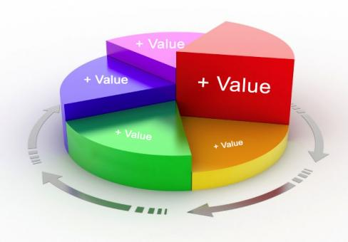

```{r setup, include=FALSE}
options(htmltools.dir.version = FALSE)
knitr::opts_chunk$set(echo=F,
                      message=F,
                      warning=F,
                      fig.retina = 3,
                      fig.align = "center")
library("tidyverse")
library("mosaic")
library("ggrepel")
library("fontawesome")
xaringanExtra::use_tile_view()
xaringanExtra::use_tachyons()
xaringanExtra::use_freezeframe()

update_geom_defaults("label", list(family = "Fira Sans Condensed"))
update_geom_defaults("text", list(family = "Fira Sans Condensed"))

set.seed(256)
```

class: inverse

# Outline

### [Production, Specialization, & Comparative Advantage](#7)
### [What Do Firms Do?](#33)

---

# Producer Behavior

.pull-left[

- How do **producers** decide:
  - which products to produce
  - in what quantity
  - using which inputs
  - and sold at what price?

- Answers to these questions are building blocks for .hi-red[supply curves]
]

.pull-right[

.center[

]
]

---

# The Basics of Production

.pull-left[

- Nearly all goods must be **produced** before we can exchange & consume them

- .hi[Consumption] is the **using up** of value to gain utility
  - .hi-purple[Consumption is the ultimate goal of all economic activity]
]

.pull-right[

.center[

]
]

---

# The Basics of Production

.pull-left[

- .hi[Production] is the **creation** of value, by transforming *lower*-valued goods (resources, inputs, etc) into *higher*-valued goods (outputs, consumer products, etc)

- Iron Ore $\rightarrow$ Steel $\rightarrow$ Buildings, Bridges, Ovens, Water Bottles
]

.pull-right[

.center[

]
]

---

# It's Demand all the Way Down!

.pull-left[

- .hi-red[Supply] is actually .hi-blue[Demand] in disguise!

- An .hi[(opportunity) cost] to buy (scarce) inputs for production because **other people** .hi-blue[demand] those same inputs to consume or produce **other valuable things**!
  - Price necessary to **pull them out of other valuable productive uses** in the economy!
]

.pull-right[

.center[

]
]

---

class: inverse, center, middle

# Production, Specialization, & Comparative Advantage

---

# Production, Specialization, & Comparative Advantage

.pull-left[

- Consider a simple example — Robinson Crusoe stranded on a deserted island

- .hi[“Autarky”]: complete self-sufficiency; no exchange with others

- Anything he wants to consume, he must first produce by himself

]

.pull-right[
.center[

]
]

---

# Production, Specialization, & Comparative Advantage

.pull-left[

- Suppose on this tropical island, there is the potential to produce two goods:
  - Bananas
  - Coconuts

]

.pull-right[
.center[

]
]

---

# Production, Specialization, & Comparative Advantage

.pull-left[

.smallest[
- Two plots of land, with different fertility

|    | Max Bananas | Max Coconuts |
|----|------------:|-------------:|
| .blue[Plot A] | 10 | 5 |
| .green[Plot B] | 45 | 15 |

]

]

.pull-right[
.center[

]
]

---

# Production, Specialization, & Comparative Advantage

.pull-left[

.smallest[
- Two plots of land, with different fertility

|    | Max Bananas | Max Coconuts |
|----|------------:|-------------:|
| .blue[Plot A] | 10 | 5 |
| .green[Plot B] | 45 | 15 |

- For each plot, the .hi[(opportunity) cost] of producing a marginal unit:<sup>.magenta[†]</sup>

|    | 1 Banana | 1 Coconut |
|----|---------:|----------:|
| .blue[Plot A] | 0.5C | 2B |
| .green[Plot B] | 0.33C | 3B |

]

]

.pull-right[
.center[

]
.footnote[<sup>.magenta[†]</sup> In other words, the .hi[marginal cost]!]

]

---

# Production, Specialization, & Comparative Advantage

.pull-left[

.smallest[
- Two plots of land, with different fertility

|    | Max Bananas | Max Coconuts |
|----|------------:|-------------:|
| .blue[Plot A] | 10 | 5 |
| .green[Plot B] | 45 | 15 |

- For each plot, the .hi[(opportunity) cost] of producing a marginal unit:<sup>.magenta[†]</sup>

|    | 1 Banana | 1 Coconut |
|----|---------:|----------:|
| .blue[Plot A] | 0.5C | 2B |
| .green[Plot B] | 0.33C | 3B |

]

]

.pull-right[

```{r ppf_jagged}
library(geomtextpath)

labels<-tribble(
  ~x, ~y, ~plot, ~lab,
  25, 18, "B", "slope = -1/3",
  50, 10, "A", "slope = -1/2"
)

green_fill <- tribble(
  ~x, ~y,
  0, 0,
  0, 20,
  45, 15,
  45, 0
)

blue_fill <- tribble(
  ~x, ~y,
  45, 15,
  45, 0,
  55, 0,
)

ppf_jagged<-ggplot(data=labels,
       x = x,
       y = y,
       color = plot)+
  geom_polygon(data = blue_fill, aes(x = x, y = y), fill = "blue", alpha = 0.5)+
  geom_polygon(data = green_fill, aes(x = x, y = y), fill = "green", alpha = 0.5)+
  geom_textsegment(x = 0, y = 20,
               xend = 45, yend = 15,
               size = 4, aes(color = "B"),
               label = "slope = -1/3",
               vjust = -0.9,
               linewidth = 2)+
  geom_textsegment(x = 45, y = 15,
               xend = 55, yend = 0,
               size = 4, aes(color = "A"),
               linewidth = 2,
               label = "slope = -1/2",
               vjust = -1)+
  #geom_label(data = labels,
  #           aes(x = x, y = y, label = lab, color = plot),
  #           show.legend = F)+
  #scale_color_manual("Plot", values = c("A" = "green", "B" = "red"))+
  scale_color_viridis_d("Plot", begin = 0.25, end = 0.75, option = "d")+
  annotate(geom = "text", x = 22.5, y = 5, label = "Plot B", color = "white", size = 5)+
  annotate(geom = "text", x = 48, y = 5, label = "Plot A", color = "white", size = 5)+
  scale_x_continuous(breaks = seq(0,60,5),
                     limits = c(0,60),
                     expand=expand_scale(mult=c(0,0.1)))+
  scale_y_continuous(breaks = seq(0,60,5),
                     limits = c(0,60),
                     expand=expand_scale(mult=c(0,0.1)))+
  labs(x = "Bananas",
       y = "Coconuts")+
  theme_classic(base_family = "Fira Sans Condensed", base_size = 16)+
  #guides(color = guide_legend(override.aes = list(shape = 1)))
  theme(legend.position = "none")
ppf_jagged
```

.source[<sup>.magenta[†]</sup> In other words, the .hi[marginal cost]!]

]

---

# Production, Specialization, & Comparative Advantage

.pull-left[

- .hi[Production possibilities frontier (PPF)] displaying possible combinations of outputs

- Slope of PPF called .hi[“marginal rate of transformation” (MRT)]
  - can just call it .hi[marginal cost]

]

.pull-right[

```{r, ref.label="ppf_jagged"}
```

]

---

# Production, Specialization, & Comparative Advantage

.pull-left[

.smaller[
- .hi-purple[Increasing marginal cost]: to produce more of a good, (opportunity) cost rises as he cultivates more plots of land

- Producing **Bananas** (x-axis), start with most productive plot first (.green[Plot B]), then start cultivation on (.blue[Plot A])
  - .hi-turquoise[“Intensive margin”]: producing more on existing (most productive) plot (.green[Plot B])
  - .hi-orange[“Extensive margin”]: bringing new (worse) plots into cultivation for production (moving to .blue[Plot A])
]
]

.pull-right[

```{r}
ppf_jagged+
  annotate("segment", x = 2.5, xend = 45, y = 30, yend = 30, colour = "green", size=1.5, linetype = "dashed")+
  annotate("text", x = 22.5, y = 33, label = "Intensive", color = "green", size = 6)+
  annotate("segment", x = 45, xend = 55, y = 30, yend = 30, colour = "blue", size=1.5, linetype = "dashed", alpha=1, arrow=arrow(length=unit(0.5,"cm"), ends="last", type="closed"))+
  annotate("text", x = 50, y = 33, label = "Extensive", color = "blue", size = 6)

```

]

---

# Production, Specialization, & Comparative Advantage

.pull-left[

- Imagine now there are *many* various plots of land, differing in quality

- So a more-fully curved .blue[PPF]

]

.pull-right[

```{r}
home_point<-tribble(
  ~x, ~y, ~letter,
  2, 2.75, "A"
)

home_ppf_eq =function(x){sqrt(9-(x-0.75)^2)}
home_IC_1 = function(x){1.75+(2/x)}
home_price_1 = function(x){3.75-0.5*x}

home_ppf_1<-ggplot(data.frame(x=c(0,10)), aes(x=x))+
  stat_function(fun = home_ppf_eq, geom = "line", color = "blue", size = 2)+
  geom_label(x = 3.5, y = home_ppf_eq(3.5), label = "PPF", size = 3, color = "blue")+
  labs(x = "Bananas",
       y = "Coconuts")+
    scale_x_continuous(breaks=NULL,
                       limits=c(0,5),
                     expand=expand_scale(mult=c(0,0.1)))+
  scale_y_continuous(breaks=NULL,
                     limits=c(0,5),
                     expand=expand_scale(mult=c(0,0.1)))+
  theme_classic(base_family = "Fira Sans Condensed", base_size=20)
home_ppf_1
```
]

---

# Production, Specialization, & Comparative Advantage

.pull-left[

- Imagine now there are *many* various plots of land, differing in quality

- So a more-fully curved .blue[PPF]

- Again, **increasing marginal cost** with more production (moving to worse land)
  - Producing more *Bananas*, $(A \rightarrow B)$, slope gets *steeper*
  - Producing more *Coconuts*, $(A \leftarrow B)$, slope gets *flatter*


]

.pull-right[

```{r}
export_b=tribble(
  ~x, ~y, ~letter,
  3.15, 1.8, "B"
)

home_ppf_world_price = function(x){6.6-1.5*x}

home_ppf_1+  stat_function(fun = home_price_1, geom = "line", color = "purple", size = 1, linetype = "dashed")+
  geom_segment(x = 0, xend = 2, y = 2.75, yend = 2.75, linetype = "dotted", size = 1)+
  geom_segment(x = 2, xend = 2, y = 2.75, yend = 0, linetype = "dotted", size = 1)+
  geom_point(data = home_point,
             mapping=aes(x=x, y=y),
             size = 3)+
  geom_text_repel(data = home_point,
             mapping=aes(x=x, y=y,
             label = letter),
             seed = 4,
             size = 4)+
geom_point(data = export_b,
             aes(x = x,
                 y = y),
             size = 3)+
  geom_text_repel(data = export_b,
             aes(x = x,
                 y = y,
                 label = letter),
             seed = 4, 
             size = 4)+
  stat_function(fun = home_ppf_world_price, geom = "line", size = 1, linetype = "dashed", color = "darkorchid4")+ 
  geom_segment(x = 0, xend = 3.15, y = 1.8, yend = 1.8, linetype = "dotted", size = 1)+
  geom_segment(x = 3.15, xend = 3.15, y = 1.8, yend = 0, linetype = "dotted", size = 1)+
  scale_x_continuous(breaks=c(0,2,3.15),
                     labels=c(0, expression(b[1]), expression(b[2])),
                     limits=c(0,5),
                     expand=expand_scale(mult=c(0,0.1)))+
  scale_y_continuous(breaks=c(0,1.8, 2.75),
                     labels=c(0, expression(c[2]), expression(c[1])),
                     limits=c(0,5),
                     expand=expand_scale(mult=c(0,0.1)))+
  theme_classic(base_family = "Fira Sans Condensed", base_size=20)

  
```
]

---

# Production, Specialization, & Comparative Advantage

.pull-left[

- Based on his preferences, his productive & consumption .hi[optimum] in .hi[autarky] is point A (highest .green[Indifference curve] tangent to .blue[PPF])

- At this point:
$$\underbrace{\color{blue}{MRT}}_{\text{PPF slope}}=\underbrace{\color{green}{MRS}}_{\text{I.C. slope}}=\underbrace{\color{purple}{\frac{p_b}{p_c}}}_{\text{price line}}$$
  - .blue[MC] = .green[MB] = .purple[price]

]

.pull-right[

```{r}
home_point<-tribble(
  ~x, ~y, ~letter,
  2, 2.75, "A"
)

home_ppf_eq =function(x){sqrt(9-(x-0.75)^2)}
home_IC_1 = function(x){1.75+(2/x)}
home_price_1 = function(x){3.75-0.5*x}

home_ppf_1<-ggplot(data.frame(x=c(0,10)), aes(x=x))+
  stat_function(fun = home_ppf_eq, geom = "line", color = "blue", size = 2)+
  geom_label(x = 3.5, y = home_ppf_eq(3.5), label = "PPF", size = 3, color = "blue")+
  
  stat_function(fun = home_IC_1, geom = "line", color = "green", size = 2)+
  geom_label(x = 3.5, y = home_IC_1(3.5), label = "IC", size = 3, color = "green")+
  stat_function(fun = home_price_1, geom = "line", color = "purple", size = 1, linetype = "dashed")+
  geom_segment(x = 0, xend = 2, y = 2.75, yend = 2.75, linetype = "dotted", size = 1)+
  geom_segment(x = 2, xend = 2, y = 2.75, yend = 0, linetype = "dotted", size = 1)+
  geom_label(x = 4, y = home_price_1(4), label = expression(frac(p[b],p[c])), size = 3, color = "purple")+
  geom_point(data = home_point,
             mapping=aes(x=x, y=y),
             size = 3)+
  geom_text_repel(data = home_point,
             mapping=aes(x=x, y=y,
             label = letter),
             seed = 4,
             size = 4)+
  labs(x = "Bananas",
       y = "Coconuts")+
  scale_x_continuous(breaks=c(0,2),
                     labels=c(0, expression(b[1])),
                     limits=c(0,5),
                     expand=expand_scale(mult=c(0,0.1)))+
  scale_y_continuous(breaks=c(0,2.75),
                     labels=c(0, expression(c[1])),
                     limits=c(0,5),
                     expand=expand_scale(mult=c(0,0.1)))+
  theme_classic(base_family = "Fira Sans Condensed", base_size=20)
home_ppf_1
```
]

---

# Trade

.pull-left[

- Now suppose he has the opportunity to trade with others

- Current market exchange rate is the slope of darker purple dashed line

]

.pull-right[
```{r}
home_exp<-ggplot(data.frame(x=c(0,10)), aes(x=x))+
  
  stat_function(fun = home_ppf_eq, geom = "line", color = "blue", size = 2)+
  geom_label(x = 3.5, y = home_ppf_eq(3.5), label = "PPF", size = 3, color = "blue")+
  
  stat_function(fun = home_IC_1, geom = "line", color = "green", size = 2)+
  geom_label(x = 3.5, y = home_IC_1(3.5), label = "IC", size = 3, color = "green")+
  stat_function(fun = home_price_1, geom = "line", color = "purple", size = 1, linetype = "dashed")+
  geom_segment(x = 0, xend = 2, y = 2.75, yend = 2.75, linetype = "dotted", size = 1)+
  geom_segment(x = 2, xend = 2, y = 2.75, yend = 0, linetype = "dotted", size = 1)+
  geom_point(data = home_point,
             mapping=aes(x=x, y=y),
             size = 3)+
  geom_text_repel(data = home_point,
             mapping=aes(x=x, y=y,
             label = letter),
             seed = 4,
             size = 4)+
geom_point(data = export_b,
             aes(x = x,
                 y = y),
             size = 3)+
  geom_text_repel(data = export_b,
             aes(x = x,
                 y = y,
                 label = letter),
             seed = 4, 
             size = 4)+
  stat_function(fun = home_ppf_world_price, geom = "line", size = 1, linetype = "dashed", color = "darkorchid4")+ 
  geom_segment(x = 0, xend = 3.15, y = 1.8, yend = 1.8, linetype = "dotted", size = 1)+
  geom_segment(x = 3.15, xend = 3.15, y = 1.8, yend = 0, linetype = "dotted", size = 1)+
  scale_x_continuous(breaks=c(0,2,3.15),
                     labels=c(0, expression(b[1]), expression(b[2])),
                     limits=c(0,5),
                     expand=expand_scale(mult=c(0,0.1)))+
  scale_y_continuous(breaks=c(0,1.8, 2.75),
                     labels=c(0, expression(c[2]), expression(c[1])),
                     limits=c(0,5),
                     expand=expand_scale(mult=c(0,0.1)))+
  labs(x = "Bananas",
       y = "Coconuts")+
  theme_classic(base_family = "Fira Sans Condensed", base_size=20)
home_exp
```
]

---

# Trade

.pull-left[

- Now suppose he has the opportunity to trade with others

- Current market exchange rate is the slope of darker purple dashed line

- He will .hi[specialize] in production of Bananas, produce more of them $(A \rightarrow B)$ to trade to get coconuts
  - B is his .hi[productive optimum]
]

.pull-right[
```{r}
home_exp<-ggplot(data.frame(x=c(0,10)), aes(x=x))+
  
  stat_function(fun = home_ppf_eq, geom = "line", color = "blue", size = 2)+
  geom_label(x = 3.5, y = home_ppf_eq(3.5), label = "PPF", size = 3, color = "blue")+
  
  stat_function(fun = home_IC_1, geom = "line", color = "green", size = 2)+
  geom_label(x = 3.5, y = home_IC_1(3.5), label = "IC", size = 3, color = "green")+
  stat_function(fun = home_price_1, geom = "line", color = "purple", size = 1, linetype = "dashed")+
  geom_segment(x = 0, xend = 2, y = 2.75, yend = 2.75, linetype = "dotted", size = 1)+
  geom_segment(x = 2, xend = 2, y = 2.75, yend = 0, linetype = "dotted", size = 1)+
  geom_point(data = home_point,
             mapping=aes(x=x, y=y),
             size = 3)+
  geom_text_repel(data = home_point,
             mapping=aes(x=x, y=y,
             label = letter),
             seed = 4,
             size = 4)+
geom_point(data = export_b,
             aes(x = x,
                 y = y),
             size = 3)+
  geom_text_repel(data = export_b,
             aes(x = x,
                 y = y,
                 label = letter),
             seed = 4, 
             size = 4)+
  stat_function(fun = home_ppf_world_price, geom = "line", size = 1, linetype = "dashed", color = "darkorchid4")+ 
  geom_segment(x = 0, xend = 3.15, y = 1.8, yend = 1.8, linetype = "dotted", size = 1)+
  geom_segment(x = 3.15, xend = 3.15, y = 1.8, yend = 0, linetype = "dotted", size = 1)+
  scale_x_continuous(breaks=c(0,2,3.15),
                     labels=c(0, expression(b[1]), expression(b[2])),
                     limits=c(0,5),
                     expand=expand_scale(mult=c(0,0.1)))+
  scale_y_continuous(breaks=c(0,1.8, 2.75),
                     labels=c(0, expression(c[2]), expression(c[1])),
                     limits=c(0,5),
                     expand=expand_scale(mult=c(0,0.1)))+
  labs(x = "Bananas",
       y = "Coconuts")+
  theme_classic(base_family = "Fira Sans Condensed", base_size=20)
home_exp+annotate("segment", x = 2, xend = 3.15, y = 2.75, yend = 1.8, colour = "black", size=2, alpha=1, arrow=arrow(length=unit(0.5,"cm"), ends="last", type="closed"))
```
]

---

# Post-Trade Consumption

.pull-left[

.smallest[
- He will trade at the market prices (slope of dark purple dashed line)
]
]

.pull-right[
```{r}
home_c_point<-tribble(
  ~x, ~y, ~letter,
  1.7, 4.1, "C"
)

trade<-home_exp+geom_point(data = home_c_point,
             aes(x = x,
                 y = y),
             size = 3)+
    geom_text_repel(data = home_c_point,
             aes(x = x,
                 y = y,
                 label = letter),
             seed = 4, 
             size = 4)+
  geom_segment(x = 0, xend = 1.7, y = 4.1, yend = 4.1, linetype = "dotted", size = 1)+
  geom_segment(x = 1.7, xend = 1.7, y = 4.1, yend = 0, linetype = "dotted", size = 1)+
  
  scale_x_continuous(breaks=c(0,1.7, 2,3.15),
                     labels=c(0, expression(b[3]), expression(b[1]), expression(b[2])),
                     limits=c(0,5),
                     expand=expand_scale(mult=c(0,0.1)))+
  scale_y_continuous(breaks=c(0,1.8, 2.75, 4.1),
                     labels=c(0, expression(c[2]), expression(c[1]), expression(c[3])),
                     limits=c(0,5),
                     expand=expand_scale(mult=c(0,0.1)))
trade
```
]

---

# Post-Trade Consumption

.pull-left[

.smallest[
- He will trade at the market prices (slope of dark purple dashed line)
  - .purple[Sell (export)] his specialized good, Bananas
]
]

.pull-right[
```{r}
trade+annotate("segment", x = 3.15, xend = 1.7, y = 1.8, yend = 1.8, colour = "purple", size=2, alpha=1, arrow=arrow(length=unit(0.5,"cm"), ends="last", type="closed"))
```
]

---

# Post-Trade Consumption

.pull-left[

.smallest[
- He will trade at the market prices (slope of dark purple dashed line)
  - .purple[Sell (export)] his specialized good, Bananas
  - .orange[Buy (import)] from others, Coconuts
]
]

.pull-right[
```{r}
trade+annotate("segment", x = 3.15, xend = 1.7, y = 1.8, yend = 1.8, colour = "purple", size=2, alpha=1, arrow=arrow(length=unit(0.5,"cm"), ends="last", type="closed"))+annotate("segment", x = 1.7, xend = 1.7, y = 1.8, yend = 4.1, colour = "orange", size=2, alpha=1, arrow=arrow(length=unit(0.5,"cm"), ends="last", type="closed"))
```
]

---

# Post-Trade Consumption

.pull-left[

.smallest[
- He will trade at the market prices (slope of dark purple dashed line)
  - .purple[Sell (export)] his specialized good, Bananas
  - .orange[Buy (import)] from others, Coconuts

- Allows him to reach higher .green[indifference curve] at point C, new .hi[consumption optimum]
  - Again, at this point (but at new market prices, instead of autarky prices!):
$$\underbrace{\color{blue}{MRT}}_{\text{PPF slope}}=\underbrace{\color{green}{MRS}}_{\text{I.C. slope}}=\underbrace{\color{purple}{\frac{p_b}{p_c}}}_{\text{price line}}$$
  - .blue[MC] = .green[MB] = .purple[price]
]
]

.pull-right[
```{r trade}
home_high_IC=function(x){1.75+(4/x)}

trade+stat_function(fun = home_high_IC, geom = "line", size = 2, color = "darkgreen")+annotate("segment", x = 3.15, xend = 1.7, y = 1.8, yend = 1.8, colour = "purple", size=2, alpha=1, arrow=arrow(length=unit(0.5,"cm"), ends="last", type="closed"))+annotate("segment", x = 1.7, xend = 1.7, y = 1.8, yend = 4.1, colour = "orange", size=2, alpha=1, arrow=arrow(length=unit(0.5,"cm"), ends="last", type="closed"))
```
]

---

# Takeaways

.pull-left[

1. .hi-purple[Trade is good]
  - Reaches higher indifference curve, beyond PPF!

]

.pull-right[
```{r, ref.label="trade"}
```
]

---

# Takeaways: Specialization & Exchange

.pull-left[

1. Trade is good

2. .hi[Specialization] and .hi[exchange]
  - specialize in producing whatever good you have the .hi[comparative advantage] (lower opportunity cost) in
  - buy (import) **everything else**!
  - can be comparatively good at something, or comparatively bad at everything else!
]

.pull-right[
```{r, ref.label="trade"}
```
]

---

# Takeaways: Comparative Advantage

.center[

]

---

# Takeaways: Comparative Advantage

.center[

]

---

# The Division of Labor

.left-column[
.center[


Adam Smith

1723-1790
]
]

.right-column[

> "The greatest improvement in the productive powers of labour, and the greater part of the skill, dexterity, and judgment with which it is any where directed, or applied, seem to have been the effects of the .hi[division of labour]," (Book I, Chapter 1).
]

.source[Smith, Adam, 1776, [*An Enquiry into the Nature and Causes of the Wealth of Nations*](https://www.econlib.org/library/Smith/smWN.html)]

---

# Takeaways: Specialization & Exchange

.pull-left[

.smaller[
1. Trade is good

2. .hi[Specialization] and .hi[exchange]
  - specialize in producing whatever good you have the .hi[comparative advantage] (lower opportunity cost) in
  - buy (import) **everything else**!
  - can be comparatively good at something, or comparatively bad at everything else!

- Learn much more in my [international trade](https://tradef20.classes.ryansafner.com) course
]
]
.pull-right[
.center[

]
]

---

# Takeaways

.pull-left[
.smaller[
1. Trade is good
2. Specialization and comparative advantage
3. .hi-purple[Price differences imply gains from trade]
  - different price lines in “autarky” vs. with trade
  - **the more different his price is vs. market, the better off he will be**!
]
]

.pull-right[
```{r, ref.label="trade"}
```
]

---

# Takeaways

.pull-left[
.smaller[
1. Trade is good
2. Specialization and comparative advantage
3. Price differences imply gains from trade
4. A .hi[theory of the firm]
  - Productive optimum (B) is independent of preferences!
  - *Any* rational producer would make the same decision, regardless of preferences (or ownership structure)
      - sole-proprietor, partnership, corporation, non-profit, workers co-op, etc.
]
]
.pull-right[
```{r, ref.label="trade"}
```
]

---

# Takeaways

.pull-left[
.smaller[
1. Trade is good
2. Specialization and comparative advantage
3. Price differences imply gains from trade
4. A theory of the firm
5. .hi[Competitive firms produce where p = MC]
  - Point B:
  
$$\underbrace{\color{blue}{MRT}}_{\text{PPF slope}}=\underbrace{\color{purple}{\frac{p_b}{p_c}}}_{\text{price line}}$$
  - .blue[MC] = .purple[price]
]
]
.pull-right[
```{r, ref.label="trade"}
```
]

---

class: inverse, center, middle

# What Do Firms Do?

---

# The Firm

.pull-left[
- In modern market economies, most production takes place in an organization known as a .hi[firm]
  - A legal fiction for particular purposes

- It does not *have* to be this way, and for most of history it was not this way!
    - Craft guilds
    - Independent artisans
    - Independent contractors

]

.pull-right[

.center[

]
]

---

# If Markets Are So Great, Why Do Firms Exist?

.pull-left[
.smallest[
- Firms exist in the forms they do because they are .hi-turquoise[an efficient response to particular problems of economic organization]

- Lots of interesting & Nobel-prize winning analysis

- For now, we'll sidestep these and just *assume* firms exist. Learn more in my .hi[Industrial Organization] course:
  - [Why Are There Firms?](https://ios20.classes.ryansafner.com/class/3.1-class/)
  - [The Firm as Nexus of Contracts](https://ios20.classes.ryansafner.com/class/3.2-class/)
  - [Asset Specificity and Vertical Integration](https://ios20.classes.ryansafner.com/class/3.3-class/)
  - [Contractual Restraints & Property Rights](https://ios20.classes.ryansafner.com/class/3.4-class/)

]
]

.pull-right[

.center[

]
]

---

# What Do Firms Do? I

.pull-left[

- We'll assume “the firm” is the agent to model:

- So what do firms do? 

- How would we set up an optimization model:

1. **Choose:** .hi-blue[ < some alternative >]

2. **In order to maximize:** .hi-green[< some objective >]

3. **Subject to:** .hi-red[< some constraints >]

]

.pull-right[

.center[

]
]

---

# What Do Firms Do? II

.pull-left[
.smaller[
- Firms convert some goods to other goods: 
]
]

.pull-right[
.center[

]
]

---

# What Do Firms Do? II

.pull-left[
.smaller[
- Firms convert some goods to other goods: 

- **Inputs**: $x_1, x_2, \cdots, x_n$
  - <span class="green">**Examples**: worker efforts, warehouse space, electricity, loans, oil, cardboard, fertilizer, computers, software programs, etc<span>
  ]
]

.pull-right[
.center[

]
]

---
# What Do Firms Do? II

.pull-left[
.smaller[
- Firms convert some goods to other goods: 

- **Inputs**: $x_1, x_2, \cdots, x_n$
  - <span class="green">**Examples**: worker efforts, warehouse space, electricity, loans, oil, cardboard, fertilizer, computers, software programs, etc<span>
  
- **Output**: $q$
  - <span class="green">**Examples**: gas, cars, legal services, mobile apps, vegetables, consulting advice, financial reports, etc<span>
]
]

.pull-right[
.center[

]
]

---

# What Do Firms Do? III

.pull-left[
- .hi[Technology] or a .hi[production function]: rate at which firm can convert specified **inputs** $(x_1, x_2, \cdots, x_n)$ into **output** $(q)$
$$q=f(x_1, x_2, \cdots, x_n)$$

]

.pull-right[
.center[

]
]

---

# Production Function as Recipe

.pull-left[
.center[The production function


]
]

.pull-right[
.center[The production algorithm


]

]

---

# Factors of Production I

$$q=A \,f(t,l,k)$$

.pull-left[
.smaller[
- Economists typically classify inputs, called the .hi[“factors of production” (FOP)]:

```{r,results="asis"}
tribble(
  ~"Factor", ~"Owned By", ~"Earns",
  "Land (t)", "Landowners", "Rent",
  "Labor (l)", "Laborers", "Wages",
  "Capital (k)", "Capitalists", "Interest",
) %>%
  knitr::kable(., format="html")
```
]
.smallest[
- $A$: .b["total factor productivity"] (ideas/knowledge/institutions)
- and Entrepreneurs/Owners who earn .b[Profit]

]
]
.pull-right[
.center[

]

]

---

# Factors of Production II

$$q=f(l,k)$$

.pull-left[

- We will assume just two inputs: labor $l$ and capital $k$

```{r,results="asis"}
tribble(
  ~"Factor", ~"Owned By", ~"Earns",
  "Labor (l)", "Laborers", "Wages",
  "Capital (k)", "Capitalists", "Interest"
) %>%
  knitr::kable(., format="html")
```

]

.pull-right[
.center[

]

]

---

# What Does a Firm Maximize?

.pull-left[

- We will assume firms .hi-purple[maximize profit `\\((\pi)\\)`]

- Not true for all firms
    - <span class="green">**Examples**: non-profits, charities, civic associations, government agencies, criminal organizations, etc</span>

- Even profit-seeking firms may also want to maximize additional things
    - <span class="green">**Examples**: goodwill, sustainability, social responsibility, etc </span>

]

.pull-right[

.center[

]
]

---

# Profits Have a Bad Rap These Days

.center[

]

---

# What is Profit?

.pull-left[

- In economics, profit is simply **benefits minus (opportunity) costs**

]

.pull-right[
.center[

]
]

---

# What is Profit?

.pull-left[

- In economics, profit is simply **benefits minus (opportunity) costs**

- Suppose firm sells **output** $q$ at price $p$

]

.pull-right[
.center[

]
]


---

# What is Profit?

.pull-left[

- In economics, profit is simply **benefits minus (opportunity) costs**

- Suppose firm sells **output** $q$ at price $p$

- It can buy each **input** $x_i$ at an associated price $p_i$
    - labor $l$ at wage rate $w$
    - capital $k$ at rental rate $r$

]

.pull-right[
.center[

]
]

---

# What is Profit?

.pull-left[

- In economics, profit is simply **benefits minus (opportunity) costs**

- Suppose firm sells **output** $q$ at price $p$

- It can buy each **input** $x_i$ at an associated price $p_i$
    - labor $l$ at wage rate $w$
    - capital $k$ at rental rate $r$

- The profit of selling $q$ units and using inputs $l,k$ is:

]

.pull-right[
.center[

]
]

---

# Who Gets the Profits? I

.pull-left[
$$\pi=\underbrace{pq}_{revenues}-\underbrace{(wl+rk)}_{costs}$$

]

.pull-right[
.center[

]
]

---

# Reminder from Macroeconomics: “The Circular Flow”

.center[

]

---

# Who Gets the Profits? I

.pull-left[
$$\pi=\underbrace{pq}_{revenues}-\underbrace{(wl+rk)}_{costs}$$

- .hi-purple[The firm's costs are all of the factor-owner's incomes!]
    - Landowners, laborers, creditors are all paid rent, wages, and interest, respectively

]

.pull-right[
.center[

]
]

---

# Who Gets the Profits? I

.pull-left[
$$\pi=\underbrace{pq}_{revenues}-\underbrace{(wl+rk)}_{costs}$$

- Profits are the .hi-purple[residual value] leftover after paying all factors

- Profits are income for the .hi[residual claimant(s)] of the production process (i.e. **owner(s)** of a firm):
    - Entrepreneurs
    - Shareholders

]

.pull-right[
.center[

]
]

---

# Who Gets the Profits? II

.pull-left[
$$\pi=\underbrace{pq}_{revenues}-\underbrace{(wl+rk)}_{costs}$$

- Residual claimants have incentives to maximize firm's profits, as this *maximizes their own income*

- Entrepreneurs and shareholders are the only participants in production that are *not* guaranteed an income!
    - Starting and owning a firm is inherently **risky**!

]

.pull-right[
.center[

]
]
---

# People Overestimate Profits

.center[

]

.source[Source: [American Enterprise Institute](https://www.aei.org/carpe-diem/the-public-thinks-the-average-company-makes-a-36-profit-margin-which-is-about-5x-too-high-part-ii/)]

---

# Profits and Entrepreneurship: A Preview

.pull-left[

- In markets, production must face the .hi[profit test]:
    - <span class="hi-purple">Is consumer's willingness to pay $>$ opportunity cost of inputs?</span>

- Profits are an indication that **value is being created for society**

- Losses are an indication that **value is being destroyed for society**

- Survival in markets *requires* firms continually create value & earn profits
]

.pull-right[

.center[

]
]

---

# The Firm's Optimization Problem I

.pull-left[

- So what do firms do? 

1. **Choose:** .hi-blue[ < some alternative >]

2. **In order to maximize:** .hi-green[< profits >]

3. **Subject to:** .hi-red[< technology >]

- We've so far assumed they maximize profits and they are limited by their technology

]

.pull-right[

.center[

]
]

---

# The Firm's Optimization Problem II

.pull-left[
- What do firms **choose**? (Not an easy answer)

- Prices?
    - Depends on the market the firm is operating in!
    - Study of <span class="hi">industrial organization</span>
    
- Essential question: .hi-turquoise[how competitive is a market?] This will influence what firms (can) do
]

.pull-right[
.center[

]
]

---

# Industrial Organization: A Roadmap I

.pull-left[

- Begin with one extreme case: .hi[“perfect competition”]
  - Firms can choose to sell as much $q^*$ as they want
  - Firms are constrained to sell at the (exogenous) market price $\bar{p}$

- Appropriate for settings with *many* firms, each small relative to market
]

.pull-right[

.center[

]
]
---

# Interlude

.pull-left[

- After we find firm's .hi-purple[optimal decisions] in this market (and have Exam 2), we will then finally look at .hi-purple[Unit III: Market Equilibrium]

- Put .red[Supply] and .blue[Demand] together
]

.pull-right[

```{r fig.retina=3}
library(mosaic)
update_geom_defaults("label", list(family = "Fira Sans Condensed"))

Demand=function(x){10-x}
Supply=function(x){x}

eq<-tribble(
  ~letter, ~x, ~y,
  "Eq.", 5, 5
)

CS<-tibble(x=c(0,0,5),
           y=c(5,10,5))

PS<-tibble(x=c(0,0,5),
           y=c(0,5,5))

p<-ggplot(data.frame(x=c(0,10)), aes(x=x))+
  stat_function(fun=Demand, geom="line", size=2, color = "blue")+
  stat_function(fun=Supply, geom="line", size=2, color = "red")+
  geom_label(aes(x=9,y=Demand(9)), color = "blue", label="Demand", size = 6)+
  geom_label(aes(x=9,y=Supply(9)), color = "red", label="Supply", size = 6)+
  geom_segment(aes(x=0, xend=5, y=5, yend=5),size=1, linetype="dotted")+
  geom_segment(aes(x=5, xend=5, y=5, yend=0),size=1, linetype="dotted")+
  geom_polygon(data=CS, aes(x=x,y=y), fill="blue", alpha=0.5)+ #CS
  geom_polygon(data=PS, aes(x=x,y=y), fill="red", alpha=0.5)+ #PS
  geom_label(aes(x=1.5, y= 3), label="PS", color="red", size =6)+
  geom_label(aes(x=1.5, y= 7), label="CS", color="blue", size =6)+
  geom_point(data = eq,
             mapping=aes(x=x, y=y),
             size = 4)+
  geom_text_repel(data = eq,
             mapping=aes(x=x, y=y,
             label = letter),
             size = 6)+
    scale_x_continuous(breaks=seq(0,10,1),
                     limits=c(0,10),
                     expand=expand_scale(mult=c(0,0.1)))+
  scale_y_continuous(breaks=seq(0,10,1),
                     limits=c(0,10),
                     expand=expand_scale(mult=c(0,0.1)))+
  guides(fill=F)+
  labs(x = "Quantity",
       y = "Price")+
  theme_classic(base_family = "Fira Sans Condensed", base_size=20)
p

```

]

---

# Interlude

.pull-left[

- We've seen how **consumers** cause and respond to market changes
  - e.g. $(\Delta p_x$, $\Delta p_y$, $\Delta m$)
  
- We're about to explore how **producers** cause and respond to market changes

- Finally we can explain all of these market changes with Supply and Demand .hi[equilibrium models]

- Discuss how markets work, why they are good & efficient, and when they fail
]

.pull-right[

```{r fig.retina=3}
p
```

]

---

# Industrial Organization: A Roadmap II

.pull-left[
- Examine another extreme case: .hi[monopoly] of a single seller
    - Appropriate for some markets

- .hi-purple[“Imperfect competition”]: models of .hi[monopolistic competition] & .hi[oligopoly]
    - In latter case, firms act **strategically**, so we will need <span class="hi-purple">game theory</span>
    
- Firms can choose *both* $q^*$ & $p^*$ to maximize $\pi$

]

.pull-right[

.center[

]
]